# Stage A Project Report

<div align="center">

## Zoo Animal Management System

**Submitted by:**  
Yedidya Bar-Gad & Yuval Schmidet

</div>

---

## Table of Contents
1. [Introduction (System Overview)](#1-introduction-system-overview)
2. [User Interface (AI Studio)](#2-user-interface-ai-studio)
3. [Database Diagrams](#3-database-diagrams)
4. [Design Decisions & Justifications](#4-design-decisions--justifications)
5. [Data Population Methods](#5-data-population-methods)
6. [Backup & Restore Operations](#6-backup--restore-operations)
7. [Phase B: Queries and Constraints](#7-phase-b-queries-and-constraints)
   * [Dual-Form SELECT Queries](#1-dual-form-select-queries)
   * [Additional SELECT Queries](#2-additional-select-queries)
   * [UPDATE & DELETE Queries](#3-update--delete-queries)
   * [Constraints](#4-constraints)

---

## 1. Introduction (System Overview)

The **Zoo Animal Management System** is a comprehensive relational database designed to manage and track the critical operations of a modern zoological facility. Its primary functionality revolves around recording detailed information regarding the zoo's animal population, their living environments, dietary requirements, and ongoing health statuses. 

The system stores interconnected data across several key domains:
*   **Animals and Species:** Tracking individual animals (their birth dates, gender, etc.) alongside their broader species classifications and conservation statuses.
*   **Habitats:** Managing the various enclosure zones, their specific climate types, and maximum holding capacities.
*   **Medical and Dietary Management:** Logging periodic health checkups, recording animal weights and health statuses over time, as well as assigning specific nutritional diet plans and tracking daily food consumption metrics.

---

## 2. User Interface (AI Studio)

This section presents the initial mockups and user interface screens designed to interact with the database, allowing users to efficiently retrieve, insert, and update system records.

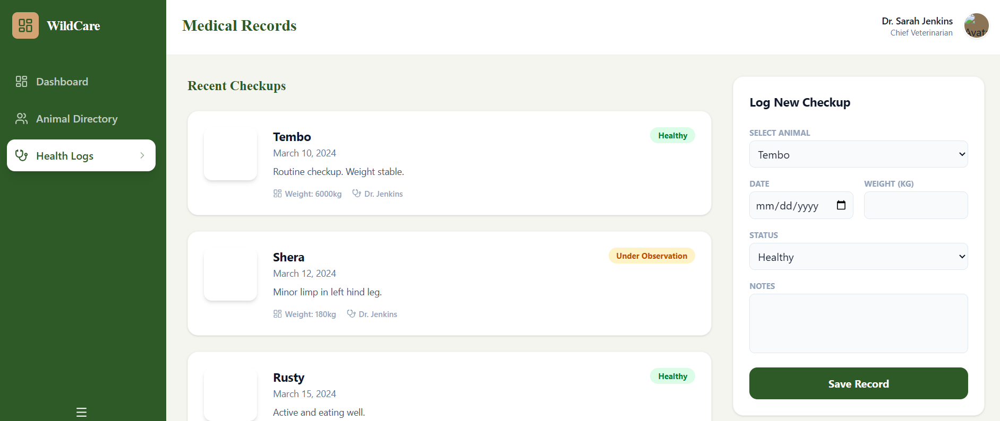


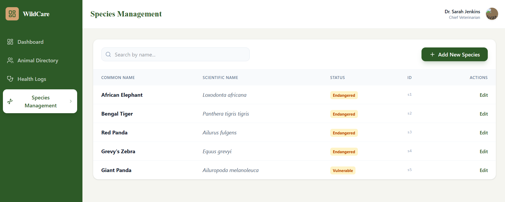


**Interactive Prototype:**  
https://ai.studio/apps/2c40fd05-35c4-457c-aa3e-f2515040b0b5

---

## 3. Database Diagrams

The architectural design of the database is visualized in the following diagrams, illustrating the entities, their attributes, and the relational mapping between them.

**Entity Relationship Diagram (ERD)**  
.png)

**Data Structure Diagram (DSD)**  
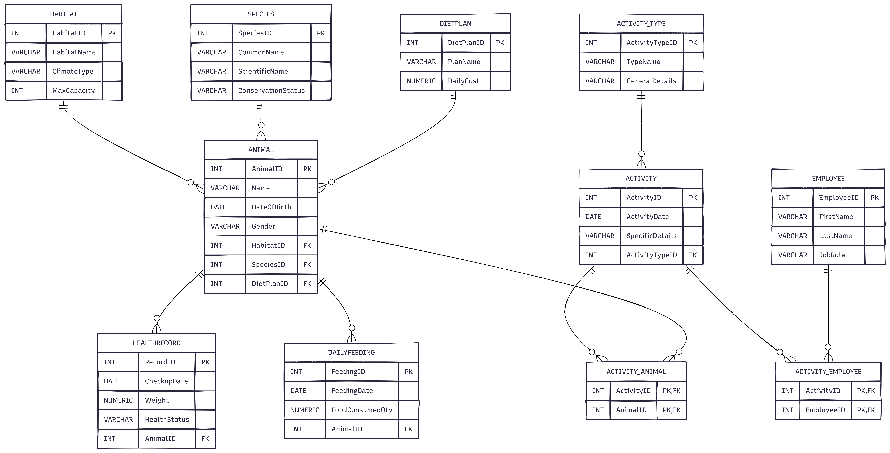

## 4. Design Decisions & Justifications

When building the database schema, several major design choices were made to ensure data integrity, eliminate redundancy, and adhere to the Third Normal Form (3NF) principles:

*   **Normalization to 3NF:** The database was rigorously normalized to prevent insert, update, and delete anomalies. For instance, rather than storing `CommonName`, `ScientificName`, and `ConservationStatus` directly inside the `ANIMAL` table, these attributes were extracted into a distinct `SPECIES` table. This ensures that species-level information is stored exactly once, reducing redundancy.
*   **Separation of Diet Plans:** Similarly, nutritional requirements are managed via a separated `DIETPLAN` table. This allows multiple animals to share the same standardized diet plan without continuously duplicating the `DailyCost` and `PlanName` attributes across the `ANIMAL` records.
*   **Historical Tracking through Composite Entities:** 
    *   The `HEALTHRECORD` table is separated from the `ANIMAL` table in a 1-to-Many relationship. This decision was deliberately made to maintain a historical log of an animal's health status and weight over time (utilizing `CheckupDate`), rather than merely overwriting a single current health status field.
    *   The `DAILYFEEDING` table acts in a similar capacity, providing a granular, longitudinal record of actual `FoodConsumedQty` per date. This allows the zoo to track dietary analytics and detect consumption anomalies over time.
*   **Data Integrity Constraints:** Strict `CHECK` constraints (e.g., `MaxCapacity > 0`, `Weight > 0`, `FoodConsumedQty >= 0`) and `NOT NULL` constraints have been enforced at the schema level to guarantee that only valid, logical data enters the system.

---

## 5. Data Population Methods

To thoroughly stress-test the schema and simulate a production-grade environment, we utilized three distinct methodologies to populate the database tables, fulfilling the requirement of having a massive dataset:

1.  **Algorithmic Data Generation (Python Script):**  
    We developed a custom Python script (`generate_data.py`) using the `csv` and `datetime` libraries to programmatically generate **20,000 records** for both the `ANIMAL` and `HEALTHRECORD` tables. This ensured the generation of heavy, realistic historical data.  
    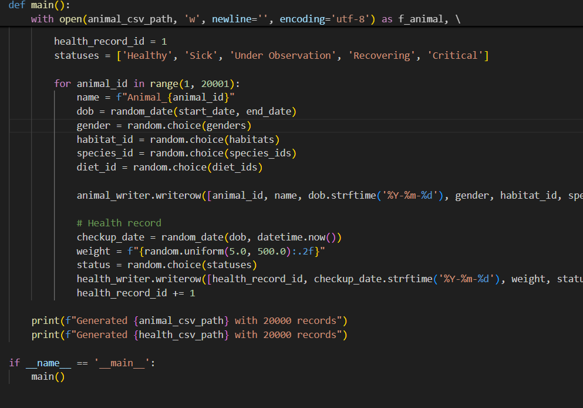

2.  **Mockaroo API (JSON Schema):**  
    For categorical lookup tables requiring realistic but varied string data (such as `SPECIES` and `DIETPLAN`), we leveraged Mockaroo. We defined a specific JSON schema to automatically generate over **500 records** per table.  
    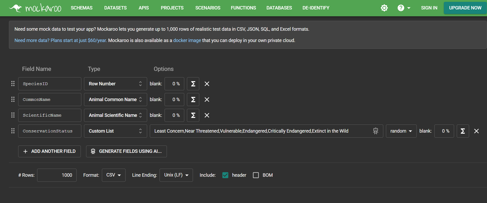

3.  **Manual SQL INSERTs:**  
    For the `HABITAT` table, we utilized a massive batch of explicit manual `INSERT INTO` SQL statements mapping out 500 distinct habitat zones, their respective climates, and capacities.  
    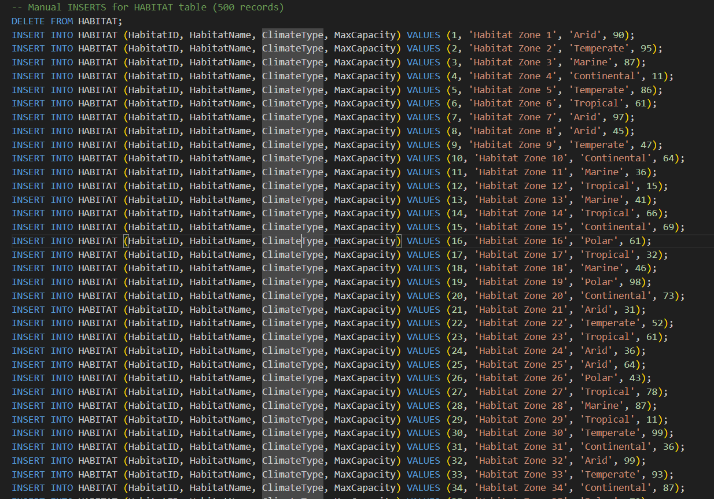

---

## 6. Backup & Restore Operations

To ensure data resilience and disaster recovery compliance, a full backup and restore procedure was successfully executed on the completed database structure and its populated records.

**Backup Execution Log:**  


**Restore Execution Log:**  

---

## 7. Phase B: Queries and Constraints

### 1. Dual-Form SELECT Queries

**Double Query 1: Total food consumed per species for animals born after 2020**  
**תיאור:** חישוב סך הכל כמויות המזון שנצרכו לכל מין (Species), עבור חיות שנולדו לאחר שנת 2020.
*   **Version A (JOIN):**
    ```sql
    SELECT S.CommonName, S.ScientificName, SUM(DF.FoodConsumedQty) AS TotalFoodConsumed
    FROM SPECIES S
    JOIN ANIMAL A ON S.SpeciesID = A.SpeciesID
    JOIN DAILYFEEDING DF ON A.AnimalID = DF.AnimalID
    WHERE EXTRACT(YEAR FROM A.DateOfBirth) > 2020
    GROUP BY S.CommonName, S.ScientificName
    ORDER BY TotalFoodConsumed DESC;
    ```
*   **Version B (Derived Table Subquery):**
    ```sql
    SELECT S.CommonName, S.ScientificName, Agg.TotalQty AS TotalFoodConsumed
    FROM SPECIES S
    JOIN (
        SELECT A.SpeciesID, SUM(DF.FoodConsumedQty) as TotalQty
        FROM ANIMAL A
        JOIN DAILYFEEDING DF ON A.AnimalID = DF.AnimalID
        WHERE EXTRACT(YEAR FROM A.DateOfBirth) > 2020
        GROUP BY A.SpeciesID
    ) Agg ON S.SpeciesID = Agg.SpeciesID
    ORDER BY TotalFoodConsumed DESC;
    ```
*   **Execution Screenshots:**
    > 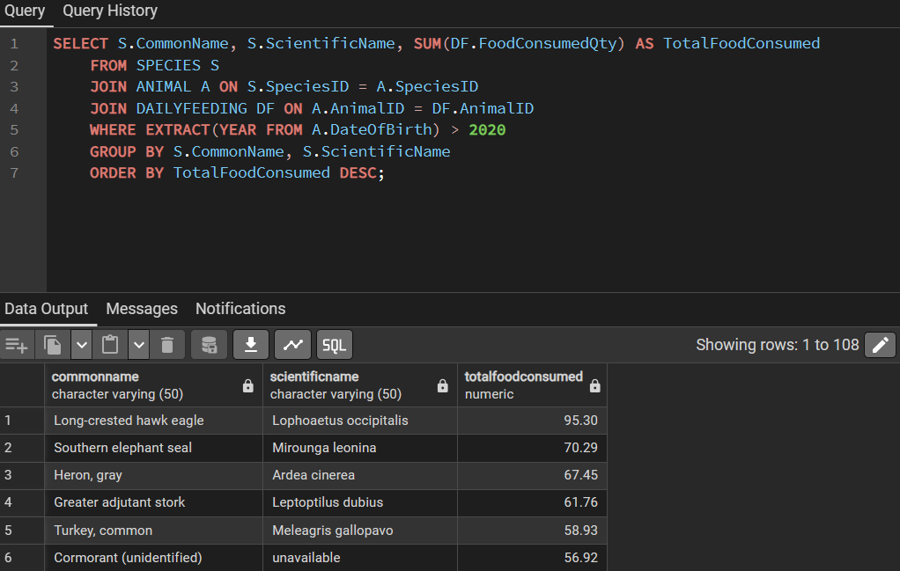
*   **Efficiency Analysis:** JOIN typically optimizes into a Hash/Merge Join gracefully performing single-sweep connections utilizing indices. However, the Subquery (Derived table) creates an obscure aggregation first which ignores global indexing initially, making standard JOIN preferred and safer for larger tables.

---

**Double Query 2: Habitat population count for animals missing checkups this year**  
**תיאור:** ספירת כמות החיות בכל אזור מחיה (Habitat), עבור חיות שלא עברו שום בדיקה רפואית בשנה הנוכחית.
*   **Version A (NOT IN):**
    ```sql
    SELECT H.HabitatName, H.ClimateType, COUNT(A.AnimalID) AS AnimalCount
    FROM HABITAT H
    JOIN ANIMAL A ON H.HabitatID = A.HabitatID
    WHERE H.HabitatID NOT IN (
        SELECT DISTINCT A2.HabitatID
        FROM ANIMAL A2
        JOIN HEALTHRECORD HR ON A2.AnimalID = HR.AnimalID
        WHERE EXTRACT(YEAR FROM HR.CheckupDate) = EXTRACT(YEAR FROM CURRENT_DATE)
    )
    GROUP BY H.HabitatName, H.ClimateType
    ORDER BY AnimalCount DESC;
    ```
*   **Version B (NOT EXISTS):**
    ```sql
    SELECT H.HabitatName, H.ClimateType, COUNT(A.AnimalID) AS AnimalCount
    FROM HABITAT H
    JOIN ANIMAL A ON H.HabitatID = A.HabitatID
    WHERE NOT EXISTS (
        SELECT 1 FROM ANIMAL A2
        JOIN HEALTHRECORD HR ON A2.AnimalID = HR.AnimalID
        WHERE A2.HabitatID = H.HabitatID 
          AND EXTRACT(YEAR FROM HR.CheckupDate) = EXTRACT(YEAR FROM CURRENT_DATE)
    )
    GROUP BY H.HabitatName, H.ClimateType
    ORDER BY AnimalCount DESC;
    ```
*   **Execution Screenshots:**
    > 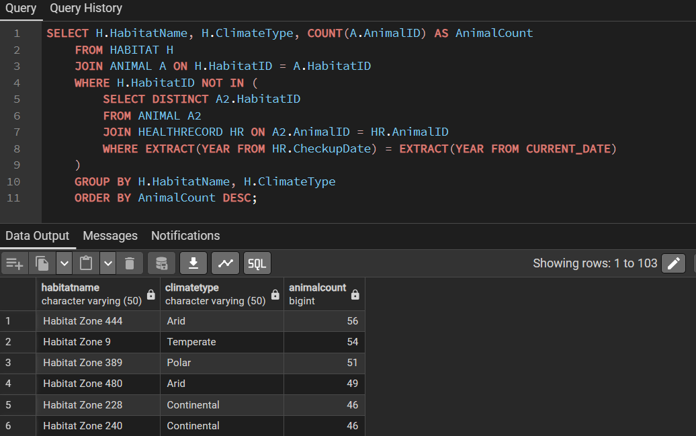
*   **Efficiency Analysis:** `NOT EXISTS` vastly outperforms `NOT IN` because it leverages an internal short-circuit mechanism (it immediately quits scanning exactly when it spots 1 match), preventing NULL contamination risk which completely zeroes-out `NOT IN` execution plans.

---

**Double Query 3: Average dietary cost per habitat for feedings in May**  
**תיאור:** מציאת העלות התזונתית היומית הממוצעת עבור חיות שקיבלו הזנה במהלך חודש מאי, מקובץ לפי אזורי מחיה.
*   **Version A (GROUP BY with JOIN):**
    ```sql
    SELECT H.HabitatName, H.ClimateType, AVG(D.DailyCost) AS AverageDietCost
    FROM HABITAT H
    JOIN ANIMAL A ON H.HabitatID = A.HabitatID
    JOIN DIETPLAN D ON A.DietPlanID = D.DietPlanID
    JOIN DAILYFEEDING DF ON A.AnimalID = DF.AnimalID
    WHERE EXTRACT(MONTH FROM DF.FeedingDate) = 5
    GROUP BY H.HabitatName, H.ClimateType
    ORDER BY AverageDietCost DESC;
    ```
*   **Version B (Correlated Subquery in SELECT):**
    ```sql
    SELECT H.HabitatName, H.ClimateType, 
           (SELECT AVG(D2.DailyCost)
            FROM ANIMAL A2
            JOIN DIETPLAN D2 ON A2.DietPlanID = D2.DietPlanID
            JOIN DAILYFEEDING DF2 ON A2.AnimalID = DF2.AnimalID
            WHERE A2.HabitatID = H.HabitatID 
              AND EXTRACT(MONTH FROM DF2.FeedingDate) = 5) AS AverageDietCost
    FROM HABITAT H
    GROUP BY H.HabitatName, H.ClimateType
    ORDER BY AverageDietCost DESC;
    ```
*   **Execution Screenshots:**
    > !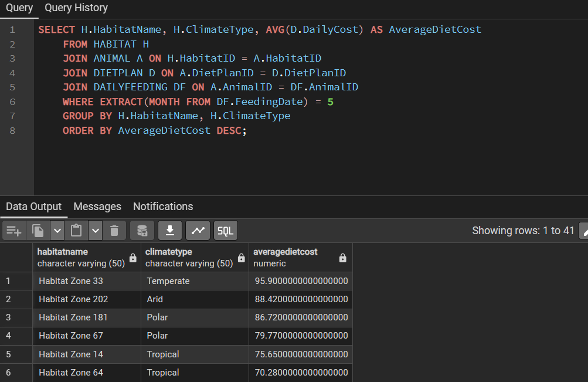
*   **Efficiency Analysis:** The JOIN method is significantly faster due to native subset hashing logic. Using an internal correlated SELECT sub-query generates an "N+1 Execution Flaw," running the calculation loop redundantly for every single Habitat outputted. 

---

**Double Query 4: Most frequent health status per species in 2024**  
**תיאור:** מציאת הסטטוס הרפואי השכיח ביותר עבור כל מין של חיה במהלך שנת 2024.
*   **Version A (Window Function):**
    ```sql
    WITH StatusAgg AS (
        SELECT S.CommonName, HR.HealthStatus, COUNT(HR.RecordID) AS StatusOccurrences,
               EXTRACT(YEAR FROM HR.CheckupDate) AS CheckupYear
        FROM SPECIES S
        JOIN ANIMAL A ON S.SpeciesID = A.SpeciesID
        JOIN HEALTHRECORD HR ON A.AnimalID = HR.AnimalID
        GROUP BY S.CommonName, HR.HealthStatus, EXTRACT(YEAR FROM HR.CheckupDate)
    )
    SELECT CommonName, HealthStatus, StatusOccurrences FROM (
        SELECT CommonName, HealthStatus, StatusOccurrences,
               ROW_NUMBER() OVER(PARTITION BY CommonName ORDER BY StatusOccurrences DESC) as rn
        FROM StatusAgg
        WHERE CheckupYear = 2024
    ) Ranked
    WHERE rn = 1
    ORDER BY StatusOccurrences DESC;
    ```
*   **Version B (MAX Subquery in HAVING):**
    ```sql
    SELECT S.CommonName, HR.HealthStatus, COUNT(HR.RecordID) AS StatusOccurrences
    FROM SPECIES S
    JOIN ANIMAL A ON S.SpeciesID = A.SpeciesID
    JOIN HEALTHRECORD HR ON A.AnimalID = HR.AnimalID
    WHERE EXTRACT(YEAR FROM HR.CheckupDate) = 2024
    GROUP BY S.CommonName, HR.HealthStatus
    HAVING COUNT(HR.RecordID) = (
        SELECT MAX(Occurrences)
        FROM (
            SELECT COUNT(HR2.RecordID) AS Occurrences FROM ANIMAL A2
            JOIN HEALTHRECORD HR2 ON A2.AnimalID = HR2.AnimalID
            WHERE A2.SpeciesID = S.SpeciesID 
              AND EXTRACT(YEAR FROM HR2.CheckupDate) = 2024
            GROUP BY HR2.HealthStatus
        ) InnerAgg
    )
    ORDER BY StatusOccurrences DESC;
    ```
*   **Execution Screenshots:**
    > 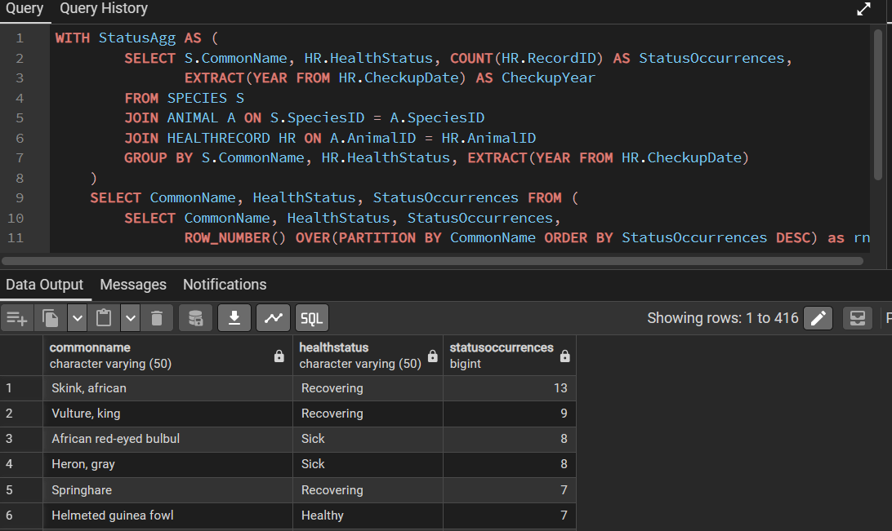
*   **Efficiency Analysis:** Window functions execute natively parsing datasets inside cache streams simultaneously whereas the `HAVING(MAX)` alternative brutally scans physical records iteratively multiple times representing atrocious algorithmic scaleability.

---

### 2. Additional SELECT Queries (שאילתות רגילות)

**Regular Query 1**
**תיאור:** סך הכל עלות התזונה היומית לכל מין, בהתחשב אך ורק בחיות שעברו בדיקה רפואית בחודש אפריל.
```sql
SELECT S.CommonName, S.ScientificName, SUM(D.DailyCost) AS TotalSpeciesDietCost
FROM SPECIES S
JOIN ANIMAL A ON S.SpeciesID = A.SpeciesID
JOIN DIETPLAN D ON A.DietPlanID = D.DietPlanID
JOIN HEALTHRECORD HR ON A.AnimalID = HR.AnimalID
WHERE EXTRACT(MONTH FROM HR.CheckupDate) = 4
GROUP BY S.CommonName, S.ScientificName
ORDER BY TotalSpeciesDietCost DESC;
```
> 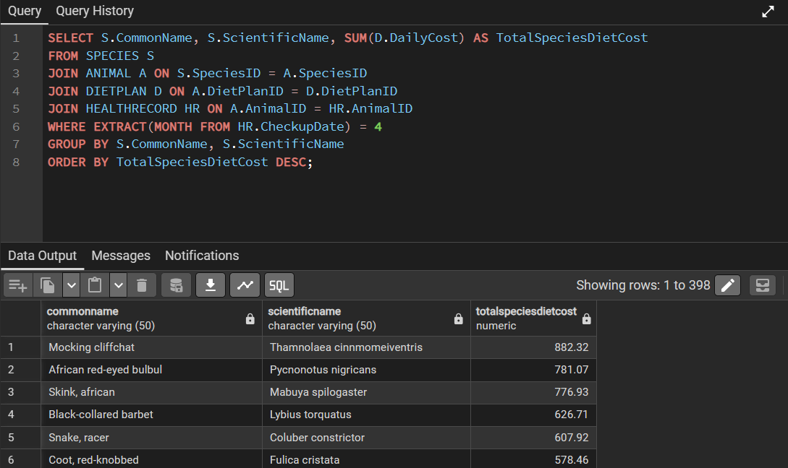

**Regular Query 2**
**תיאור:** מציאת הקיבולת הממוצעת של אזורי מחיה, מקובץ לפי סוג אקלים, עבור אזורים בהם חיות הוזנו ב-15 לכל חודש.
```sql
SELECT H.ClimateType, S.CommonName, AVG(H.MaxCapacity) AS AvgCapacity
FROM HABITAT H
JOIN ANIMAL A ON H.HabitatID = A.HabitatID
JOIN SPECIES S ON A.SpeciesID = S.SpeciesID
JOIN DAILYFEEDING DF ON A.AnimalID = DF.AnimalID
WHERE EXTRACT(DAY FROM DF.FeedingDate) = 15
GROUP BY H.ClimateType, S.CommonName
ORDER BY AvgCapacity DESC;
```
> 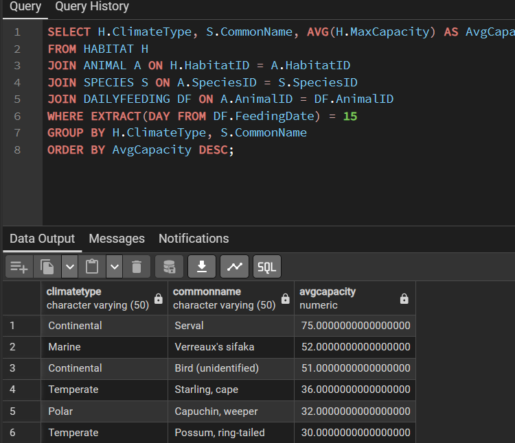

**Regular Query 3**
**תיאור:** ספירת מספר החיות החיות (שאינן מתות) המשויכות לכל תוכנית תזונה, אשר תאריך הלידה שלהן אינו בשנת 2020.
```sql
SELECT DP.PlanName, DP.DailyCost, COUNT(A.AnimalID) AS AssignedAnimalsCount
FROM DIETPLAN DP
JOIN ANIMAL A ON DP.DietPlanID = A.DietPlanID
JOIN HEALTHRECORD HR ON A.AnimalID = HR.AnimalID
WHERE EXTRACT(YEAR FROM A.DateOfBirth) <> 2020
  AND HR.HealthStatus <> 'Deceased'
GROUP BY DP.PlanName, DP.DailyCost
ORDER BY AssignedAnimalsCount DESC;
```
> 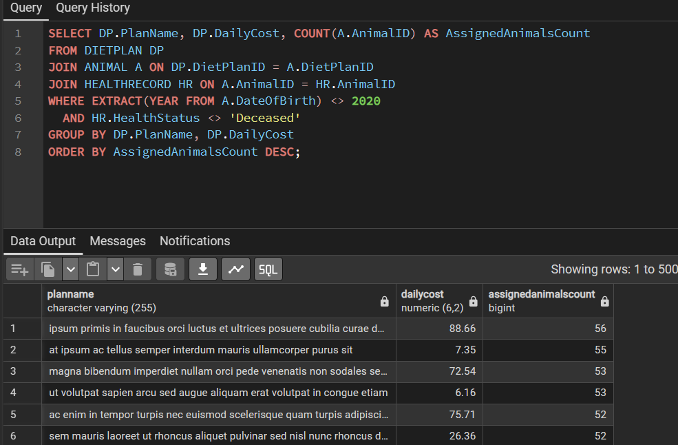

**Regular Query 4**
**תיאור:** חישוב סך כל המשקל שנמדד בבדיקות רפואיות שנערכו בחודש דצמבר, מקובץ לפי אזורי מחיה.
```sql
SELECT H.HabitatName, H.ClimateType, SUM(HR.Weight) AS TotalWeightRecorded
FROM HABITAT H
JOIN ANIMAL A ON H.HabitatID = A.HabitatID
JOIN HEALTHRECORD HR ON A.AnimalID = HR.AnimalID
WHERE EXTRACT(MONTH FROM HR.CheckupDate) = 12
GROUP BY H.HabitatName, H.ClimateType
ORDER BY TotalWeightRecorded DESC;
```
> 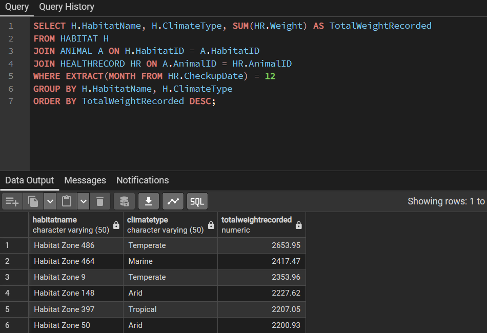

---

### 3. UPDATE & DELETE Queries (עדכון ומחיקה)

#### UPDATE Queries
**UPDATE 1:** העלאת העלות היומית ב-15% עבור תוכניות תזונה המשויכות לחייות שמוגדרות בסכנת הכחדה (Endangered).
```sql
UPDATE DIETPLAN SET DailyCost = DailyCost * 1.15
WHERE DietPlanID IN (
    SELECT A.DietPlanID FROM ANIMAL A
    JOIN SPECIES S ON A.SpeciesID = S.SpeciesID
    WHERE S.ConservationStatus = 'Endangered'
);
```
>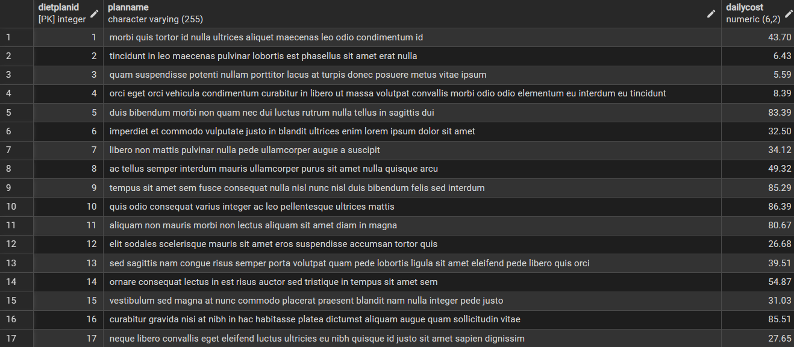 | 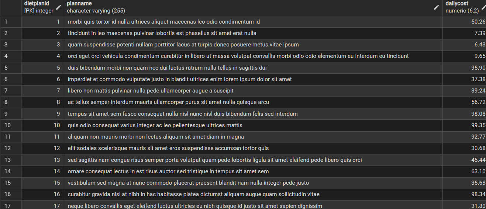
> 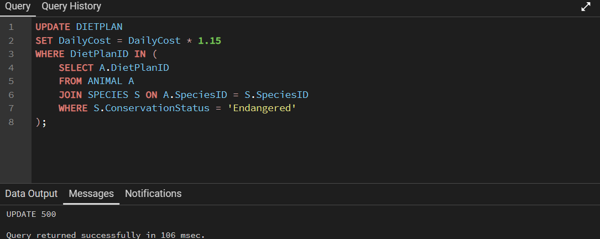


**UPDATE 2:** העברת חיות שנולדו לפני שנת 2015 לאזור המחיה בעל הקיבולת המקסימלית הגדולה ביותר.
```sql
UPDATE ANIMAL SET HabitatID = (
    SELECT HabitatID FROM HABITAT ORDER BY MaxCapacity DESC LIMIT 1
)
WHERE EXTRACT(YEAR FROM DateOfBirth) < 2015;
```
> 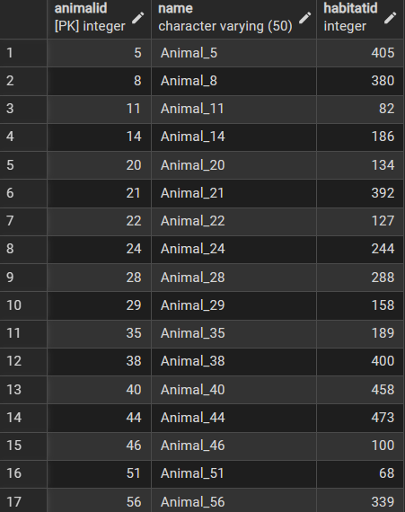 | 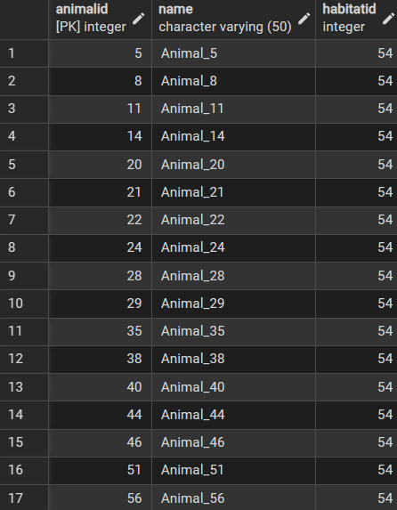
> 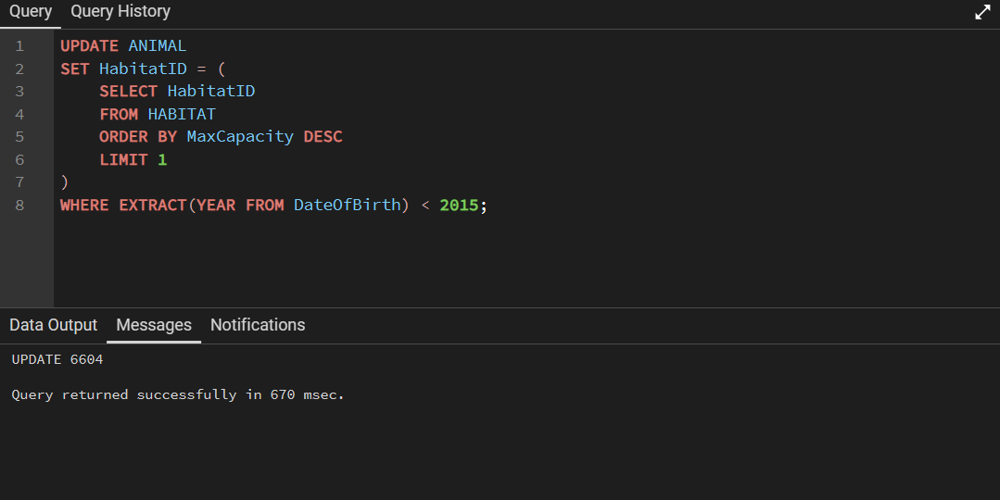

**UPDATE 3:** עדכון הסטטוס הרפואי ל-'Critical' (קריטי) עבור חיות שצרכו כמות מזון נמוכה במיוחד במהלך החודש הנוכחי.
```sql
UPDATE HEALTHRECORD SET HealthStatus = 'Critical'
WHERE AnimalID IN (
    SELECT DF.AnimalID FROM DAILYFEEDING DF
    WHERE DF.FoodConsumedQty < 2.0 AND EXTRACT(MONTH FROM DF.FeedingDate) = EXTRACT(MONTH FROM CURRENT_DATE)
);
```
> 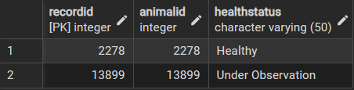 | 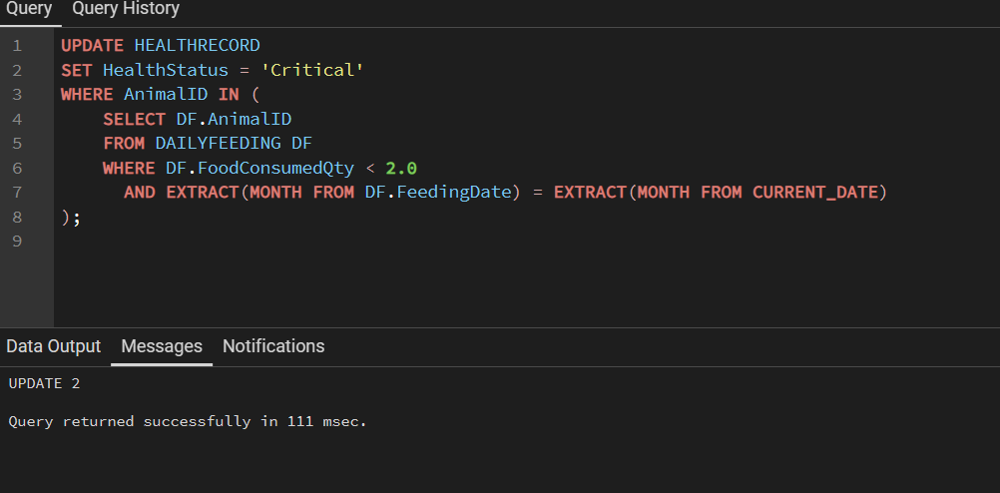
> 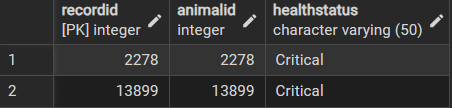

#### DELETE Queries
**DELETE 1:** מחיקת תיעודי הזנה משנים קודמות עבור חיות הנמצאות באזורי מחיה בעלי אקלים 'Continental'.
```sql
DELETE FROM DAILYFEEDING
WHERE EXTRACT(YEAR FROM FeedingDate) < EXTRACT(YEAR FROM CURRENT_DATE)
  AND AnimalID IN (
      SELECT A.AnimalID FROM ANIMAL A
      JOIN HABITAT H ON A.HabitatID = H.HabitatID WHERE H.ClimateType = 'Continental'
  );
```
> 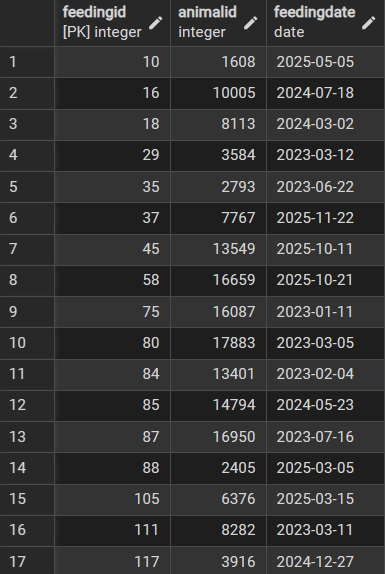 |
> 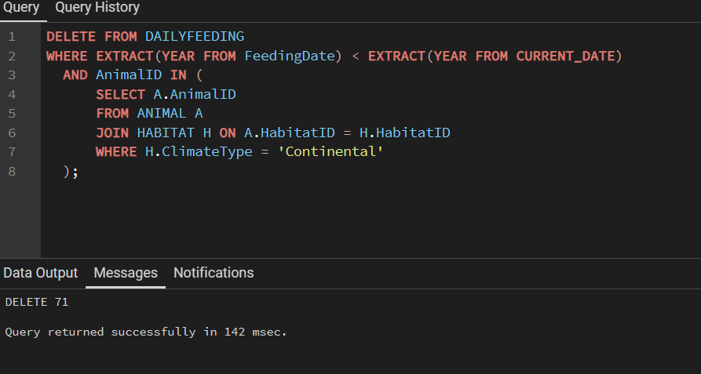

**DELETE 2:** מחיקת רשומות רפואיות של חיות שצרכו מתחת ל10 יחידות מזון בשנים האחרונות.
```sql
DELETE FROM HEALTHRECORD
WHERE AnimalID IN (
    SELECT AnimalID FROM DAILYFEEDING 
    WHERE FoodConsumedQty < 10 AND EXTRACT(YEAR FROM FeedingDate) < EXTRACT(YEAR FROM CURRENT_DATE)
);
```
> 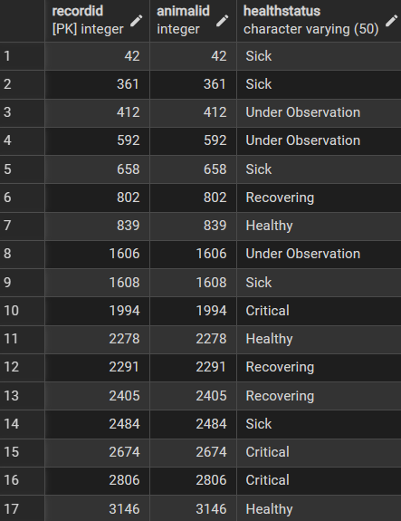 | 
> 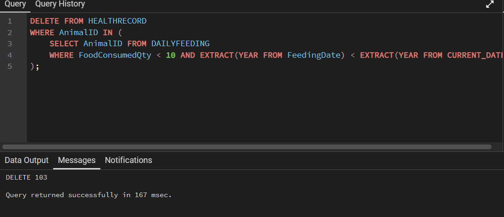

**DELETE 3:** מחיקת רשומות הזנה יומיות מהרבעון הראשון של השנה (ינואר-מרץ) עבור חיות באזורי מחיה בעלי אקלים 'Arid'.
```sql
DELETE FROM DAILYFEEDING
WHERE EXTRACT(MONTH FROM FeedingDate) IN (1, 2, 3)
  AND AnimalID IN (
      SELECT A.AnimalID FROM ANIMAL A
      JOIN HABITAT H ON A.HabitatID = H.HabitatID 
      WHERE H.ClimateType = 'Arid'
  );
```
> 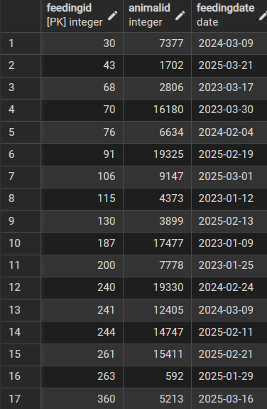 | 
> 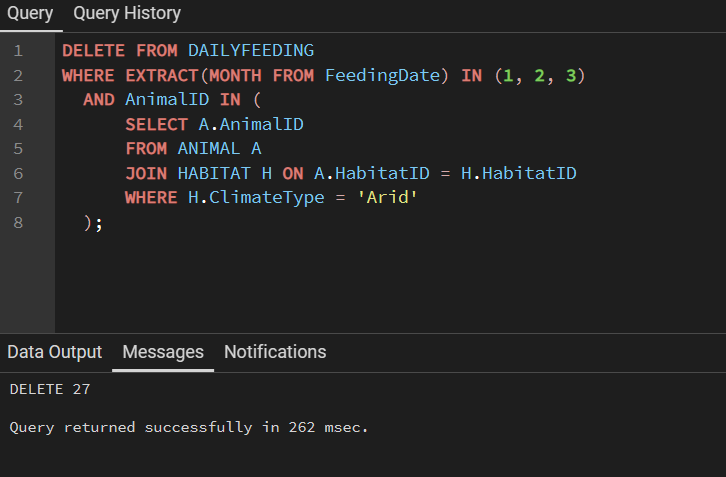

---

### 4. Constraints (אילוצי מסד נתונים)

**Constraint 1: `check_dob_past`**
**תיאור השינוי:** אילוץ `ALTER TABLE` המוודא שתאריך הלידה של בעל חיים אינו יכול להתרחש בעתיד.
```sql
ALTER TABLE ANIMAL ADD CONSTRAINT check_dob_past CHECK (DateOfBirth <= CURRENT_DATE);
```
**Violation Test:** 
```sql
INSERT INTO ANIMAL (AnimalID, Name, DateOfBirth, Gender, HabitatID, SpeciesID, DietPlanID)
VALUES (9999, 'Future Animal', CURRENT_DATE + INTERVAL '10 days', 'Male', 1, 1, 1);
```
> 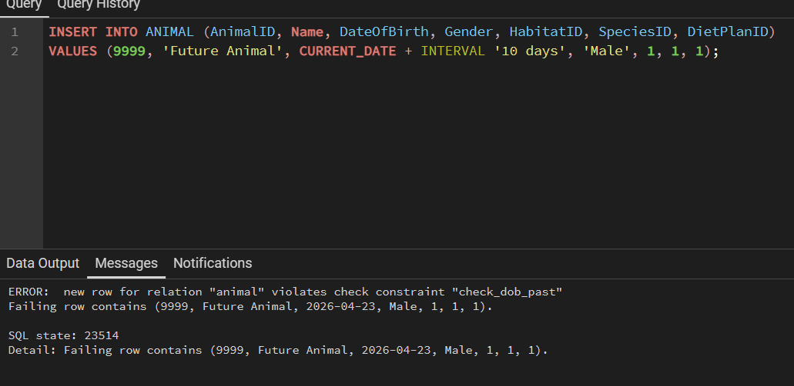

**Constraint 2: `check_valid_status`**
**תיאור השינוי:** הגבלת ערכי 'HealthStatus' לאוסף ערכים מורשים בלבד בכדי למנוע טעויות הקלדה.
```sql
ALTER TABLE HEALTHRECORD ADD CONSTRAINT check_valid_status CHECK (HealthStatus IN ('Healthy', 'Sick', 'Recovering', 'Critical', 'Deceased'));
```
**Violation Test:** 
```sql
INSERT INTO HEALTHRECORD (RecordID, CheckupDate, Weight, HealthStatus, AnimalID)
VALUES (9999, CURRENT_DATE, 50.0, 'Super Healthy', 1);
```
> 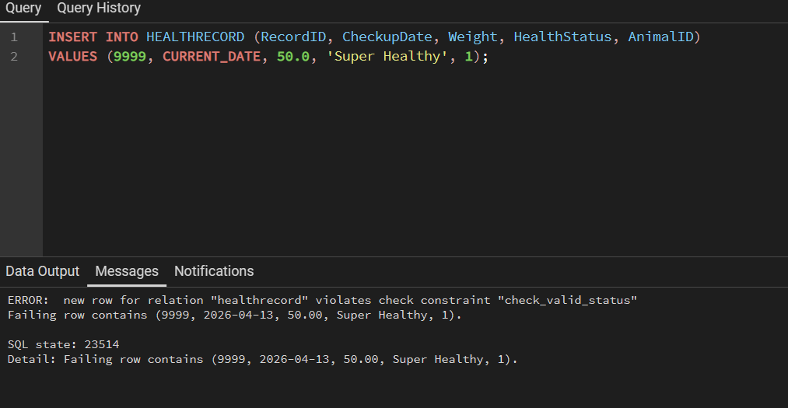

**Constraint 3: `check_feeding_past`**
**תיאור השינוי:** אילוץ המונע הכנסת תאריכי הזנה עתידיים לטבלת תעודי ההזנה היומיים בניגוד להיגיון הזמן.
```sql
ALTER TABLE DAILYFEEDING ADD CONSTRAINT check_feeding_past CHECK (FeedingDate <= CURRENT_DATE);
```
**Violation Test:** 
```sql
INSERT INTO DAILYFEEDING (FeedingID, FeedingDate, FoodConsumedQty, AnimalID)
VALUES (9999, CURRENT_DATE + INTERVAL '5 days', 10.0, 1);
```
> 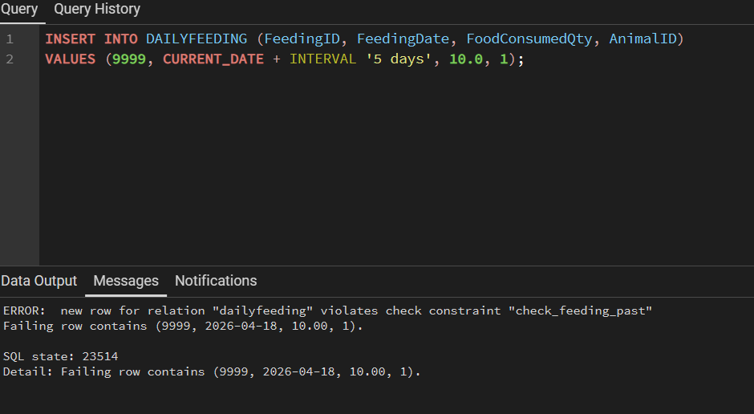

---