# Stage A Project Report

<div align="center">

## Zoo Animal Management System

**Submitted by:**  
Yedidya Bar-Gad & Yuval Schmidet

</div>

---

## Table of Contents
1. [Introduction (System Overview)](#1-introduction-system-overview)
2. [User Interface (AI Studio)](#2-user-interface-ai-studio)
3. [Database Diagrams](#3-database-diagrams)
4. [Design Decisions & Justifications](#4-design-decisions--justifications)
5. [Data Population Methods](#5-data-population-methods)
6. [Backup & Restore Operations](#6-backup--restore-operations)
7. [Phase B: Queries and Constraints](#7-phase-b-queries-and-constraints)
   * [Dual-Form SELECT Queries](#1-dual-form-select-queries)
   * [Additional SELECT Queries](#2-additional-select-queries)
   * [UPDATE & DELETE Queries](#3-update--delete-queries)
   * [Constraints](#4-constraints)
8. [Phase C: Integration (Veterinary Dept)](#8-phase-c-integration-veterinary-dept)
9. [Phase D: Programming (PL/pgSQL)](#9-phase-d-programming-plpgsql)

---

## 1. Introduction (System Overview)

The **Zoo Animal Management System** is a comprehensive relational database designed to manage and track the critical operations of a modern zoological facility. Its primary functionality revolves around recording detailed information regarding the zoo's animal population, their living environments, dietary requirements, and ongoing health statuses. 

The system stores interconnected data across several key domains:
*   **Animals and Species:** Tracking individual animals (their birth dates, gender, etc.) alongside their broader species classifications and conservation statuses.
*   **Habitats:** Managing the various enclosure zones, their specific climate types, and maximum holding capacities.
*   **Medical and Dietary Management:** Logging periodic health checkups, recording animal weights and health statuses over time, as well as assigning specific nutritional diet plans and tracking daily food consumption metrics.
*   **Staff and Activities:** Managing zoo personnel logging capabilities alongside a Many-to-Many activity tracking layer mapping employees and animals to assigned daily activity logs (shows, training occurrences, facility procedures) via dedicated junction tables.

---

## 2. User Interface (AI Studio)

This section presents the initial mockups and user interface screens designed to interact with the database, allowing users to efficiently retrieve, insert, and update system records.

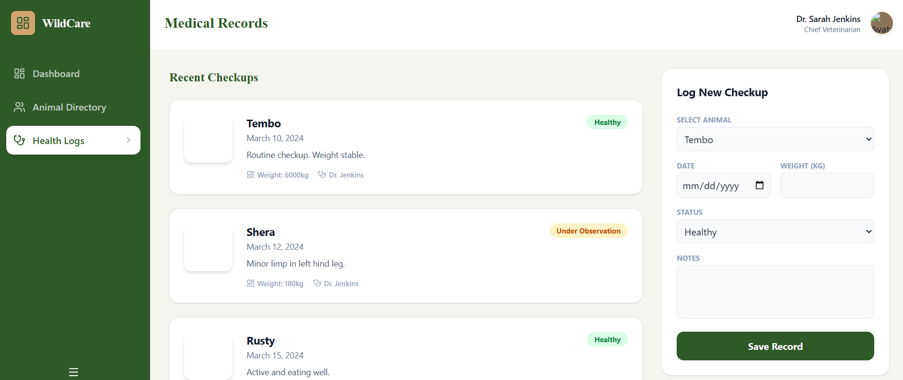


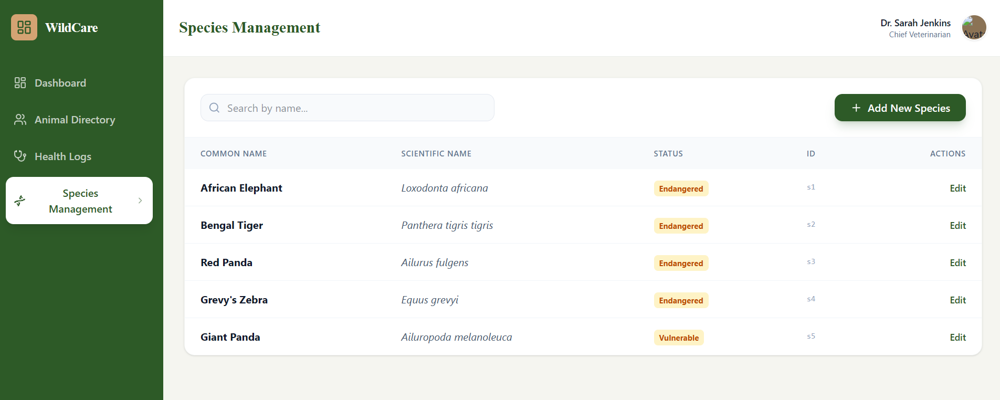


**Interactive Prototype:**  
https://ai.studio/apps/2c40fd05-35c4-457c-aa3e-f2515040b0b5

---

## 3. Database Diagrams

The architectural design of the database is visualized in the following diagrams, illustrating the entities, their attributes, and the relational mapping between them.

**Entity Relationship Diagram (ERD)**  
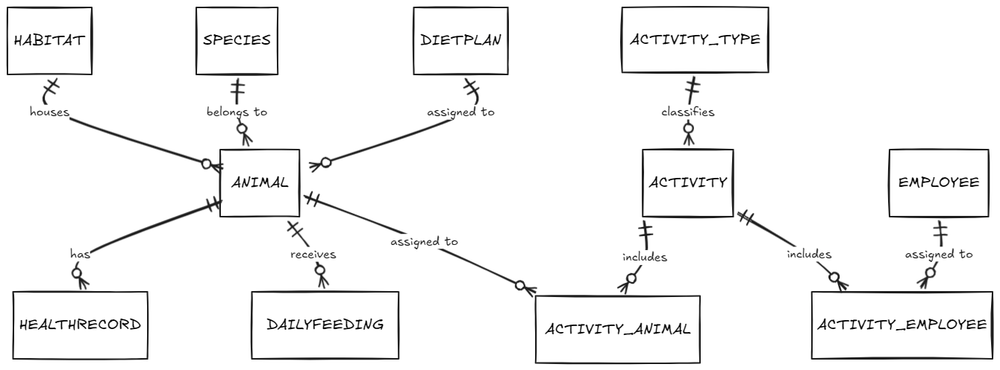

**Data Structure Diagram (DSD)**  
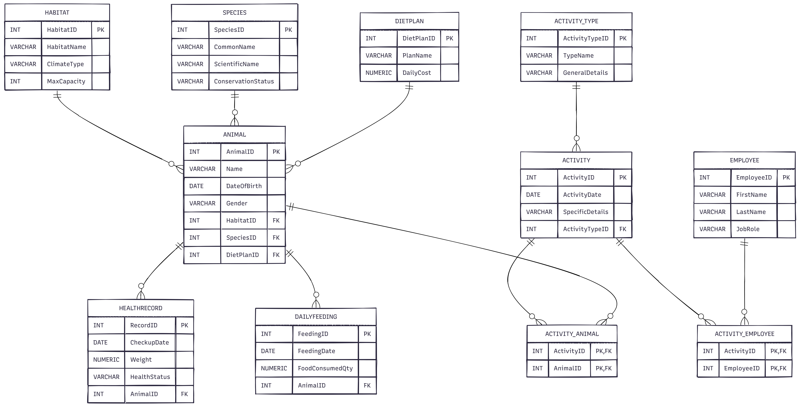

## 4. Design Decisions & Justifications

When building the database schema, several major design choices were made to ensure data integrity, eliminate redundancy, and adhere to the Third Normal Form (3NF) principles:

*   **Normalization to 3NF:** The database was rigorously normalized to prevent insert, update, and delete anomalies. For instance, rather than storing `CommonName`, `ScientificName`, and `ConservationStatus` directly inside the `ANIMAL` table, these attributes were extracted into a distinct `SPECIES` table. This ensures that species-level information is stored exactly once, reducing redundancy.
*   **Separation of Diet Plans:** Similarly, nutritional requirements are managed via a separated `DIETPLAN` table. This allows multiple animals to share the same standardized diet plan without continuously duplicating the `DailyCost` and `PlanName` attributes across the `ANIMAL` records.
*   **Historical Tracking through Composite Entities:** 
    *   The `HEALTHRECORD` table is separated from the `ANIMAL` table in a 1-to-Many relationship. This decision was deliberately made to maintain a historical log of an animal's health status and weight over time (utilizing `CheckupDate`), rather than merely overwriting a single current health status field.
    *   The `DAILYFEEDING` table acts in a similar capacity, providing a granular, longitudinal record of actual `FoodConsumedQty` per date. This allows the zoo to track dietary analytics and detect consumption anomalies over time.
*   **Many-to-Many Interconnectivity (Activity Layer):** Rather than limiting an activity occurrence to a single animal or single employee, the schema actively utilizes strict Third Normal Form (3NF) relational junction tracking (`ACTIVITY_EMPLOYEE` and `ACTIVITY_ANIMAL`). This allows dynamic logging mappings (e.g. 3 animals and 5 veterinarians involved in exactly 1 operation) safely without relying on unstable arrays or comma-delineated blocks while assuring flawless Foreign Key adherence.
*   **Data Integrity Constraints:** Strict `CHECK` constraints (e.g., `MaxCapacity > 0`, `Weight > 0`, `FoodConsumedQty >= 0`) and `NOT NULL` constraints have been enforced at the schema level to guarantee that only valid, logical data enters the system.

---

## 5. Data Population Methods

To thoroughly stress-test the schema and simulate a production-grade environment, we utilized three distinct methodologies to populate the database tables, fulfilling the requirement of having a massive dataset:

1.  **Algorithmic Data Generation (Python Script):**  
    We developed a custom Python script (`generate_data.py`) using the `csv` and `datetime` libraries to programmatically generate **20,000 records** for the `ANIMAL` and `HEALTHRECORD` tables. During the latest iteration, it was also upgraded to dynamically generate relational 500-record mock CSVs mapping our new architectural layer: `EMPLOYEE`, `ACTIVITY_TYPE`, `ACTIVITY`, alongside executing mathematically randomized Multi-to-Multi bridge links for `ACTIVITY_EMPLOYEE` and `ACTIVITY_ANIMAL`.
    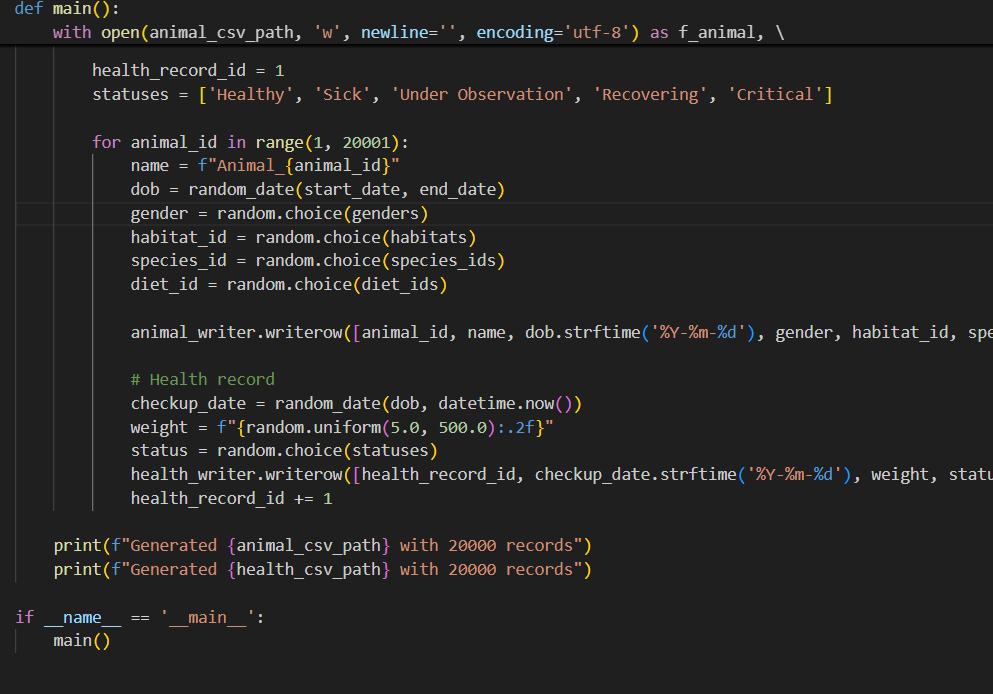

2.  **Mockaroo API (JSON Schema):**  
    For categorical lookup tables requiring realistic but varied string data (such as `SPECIES` and `DIETPLAN`), we leveraged Mockaroo. We defined a specific JSON schema to automatically generate over **500 records** per table.  
    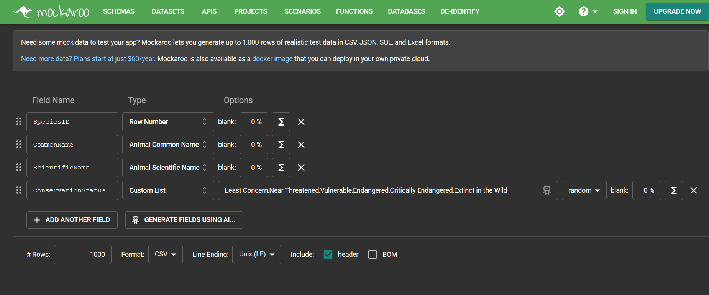

3.  **Manual SQL INSERTs:**  
    For the `HABITAT` table, we utilized a massive batch of explicit manual `INSERT INTO` SQL statements mapping out 500 distinct habitat zones, their respective climates, and capacities.  
    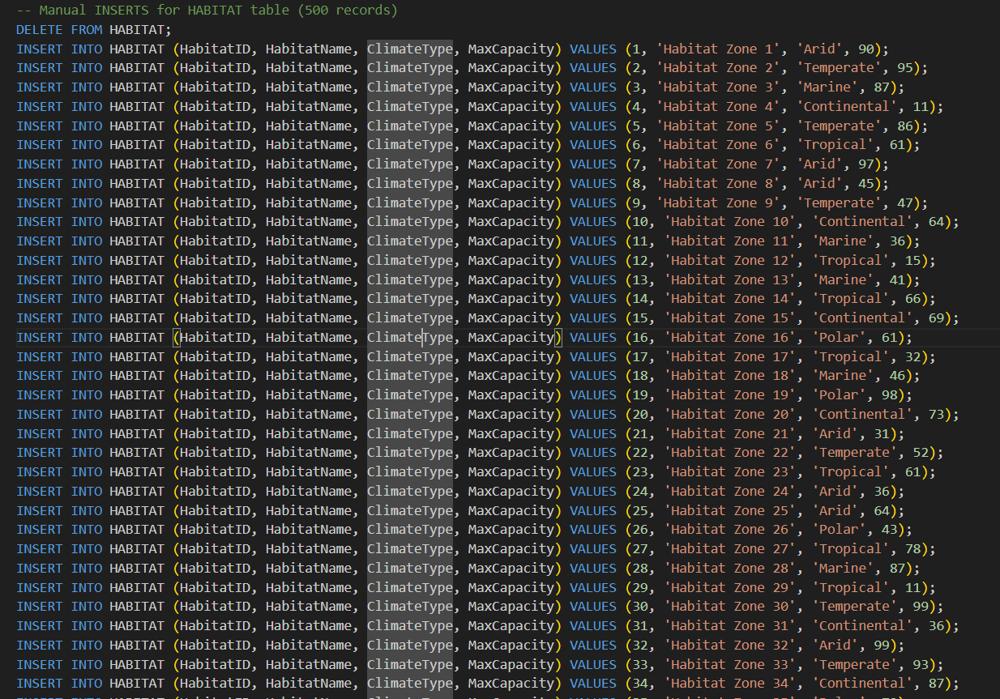

---

## 6. Backup & Restore Operations

To ensure data resilience and disaster recovery compliance, a full backup and restore procedure was successfully executed on the completed database structure and its populated records.

**Backup Execution Log:**  


**Restore Execution Log:**  

---

## 7. Phase B: Queries and Constraints

### 1. Dual-Form SELECT Queries

**Double Query 1: Total food consumed per species for animals born after 2020**  
**Description:** Calculate the total food quantities consumed per species, for animals born after the year 2020.

**Business Relevance:** Understanding food consumption for younger animals helps zoo management estimate and allocate future budget requirements for growing populations.

**Scenario:** The zoo's financial planning department is preparing the budget for the upcoming year and needs to project the dietary costs for the newest generation of animals, as they tend to have changing dietary needs as they mature.
*   **Version A (JOIN):**
    ```sql
    SELECT S.CommonName, S.ScientificName, SUM(DF.FoodConsumedQty) AS TotalFoodConsumed
    FROM SPECIES S
    JOIN ANIMAL A ON S.SpeciesID = A.SpeciesID
    JOIN DAILYFEEDING DF ON A.AnimalID = DF.AnimalID
    WHERE EXTRACT(YEAR FROM A.DateOfBirth) > 2020
    GROUP BY S.CommonName, S.ScientificName
    ORDER BY TotalFoodConsumed DESC;
    ```
*   **Version B (Derived Table Subquery):**
    ```sql
    SELECT S.CommonName, S.ScientificName, Agg.TotalQty AS TotalFoodConsumed
    FROM SPECIES S
    JOIN (
        SELECT A.SpeciesID, SUM(DF.FoodConsumedQty) as TotalQty
        FROM ANIMAL A
        JOIN DAILYFEEDING DF ON A.AnimalID = DF.AnimalID
        WHERE EXTRACT(YEAR FROM A.DateOfBirth) > 2020
        GROUP BY A.SpeciesID
    ) Agg ON S.SpeciesID = Agg.SpeciesID
    ORDER BY TotalFoodConsumed DESC;
    ```
*   **Execution Screenshots:**
    > 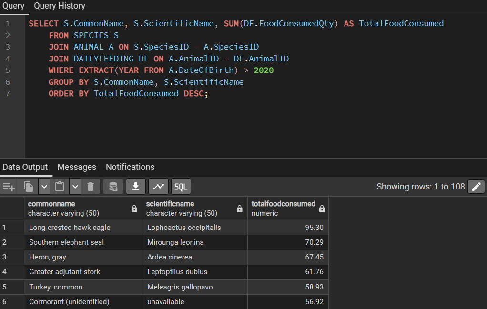
*   **Efficiency Analysis:** JOIN typically optimizes into a Hash/Merge Join gracefully performing single-sweep connections utilizing indices. However, the Subquery (Derived table) creates an obscure aggregation first which ignores global indexing initially, making standard JOIN preferred and safer for larger tables.

---

**Double Query 2: Habitat population count for animals missing checkups this year**  
**Description:** Count the number of animals in each habitat, for animals that have not had any medical checkups in the current year.

**Business Relevance:** Proactively identifying gaps in medical surveillance prevents potential disease outbreaks and ensures compliance with animal welfare regulations.

**Scenario:** The Chief Veterinarian wants to deploy mobile medical teams to specific habitats. They use this query to prioritize habitats that contain the highest number of unchecked animals to optimize the teams' schedules.
*   **Version A (NOT IN):**
    ```sql
    SELECT H.HabitatName, H.ClimateType, COUNT(A.AnimalID) AS AnimalCount
    FROM HABITAT H
    JOIN ANIMAL A ON H.HabitatID = A.HabitatID
    WHERE H.HabitatID NOT IN (
        SELECT DISTINCT A2.HabitatID
        FROM ANIMAL A2
        JOIN HEALTHRECORD HR ON A2.AnimalID = HR.AnimalID
        WHERE EXTRACT(YEAR FROM HR.CheckupDate) = EXTRACT(YEAR FROM CURRENT_DATE)
    )
    GROUP BY H.HabitatName, H.ClimateType
    ORDER BY AnimalCount DESC;
    ```
*   **Version B (NOT EXISTS):**
    ```sql
    SELECT H.HabitatName, H.ClimateType, COUNT(A.AnimalID) AS AnimalCount
    FROM HABITAT H
    JOIN ANIMAL A ON H.HabitatID = A.HabitatID
    WHERE NOT EXISTS (
        SELECT 1 FROM ANIMAL A2
        JOIN HEALTHRECORD HR ON A2.AnimalID = HR.AnimalID
        WHERE A2.HabitatID = H.HabitatID 
          AND EXTRACT(YEAR FROM HR.CheckupDate) = EXTRACT(YEAR FROM CURRENT_DATE)
    )
    GROUP BY H.HabitatName, H.ClimateType
    ORDER BY AnimalCount DESC;
    ```
*   **Execution Screenshots:**
    > 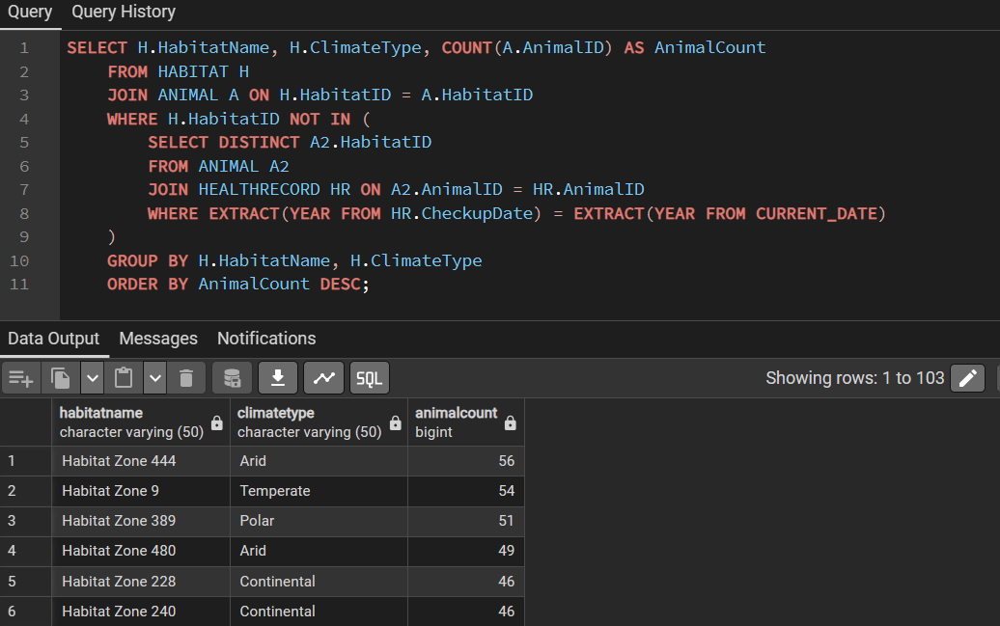
*   **Efficiency Analysis:** `NOT EXISTS` vastly outperforms `NOT IN` because it leverages an internal short-circuit mechanism (it immediately quits scanning exactly when it spots 1 match), preventing NULL contamination risk which completely zeroes-out `NOT IN` execution plans.

---

**Double Query 3: Average dietary cost per habitat for feedings in May**  
**Description:** Find the average daily dietary cost for animals that received feeding during May, grouped by habitats.

**Business Relevance:** Evaluating feeding costs on a per-habitat basis allows for accurate distribution of operational funds and identifies unusually expensive enclosures.

**Scenario:** Following a seasonal change, the procurement team reviews dietary expenses to see if certain habitats experienced a spike in feeding costs due to increased activity levels or spoiling of perishable foods.
*   **Version A (GROUP BY with JOIN):**
    ```sql
    SELECT H.HabitatName, H.ClimateType, AVG(D.DailyCost) AS AverageDietCost
    FROM HABITAT H
    JOIN ANIMAL A ON H.HabitatID = A.HabitatID
    JOIN DIETPLAN D ON A.DietPlanID = D.DietPlanID
    JOIN DAILYFEEDING DF ON A.AnimalID = DF.AnimalID
    WHERE EXTRACT(MONTH FROM DF.FeedingDate) = 5
    GROUP BY H.HabitatName, H.ClimateType
    ORDER BY AverageDietCost DESC;
    ```
*   **Version B (Correlated Subquery in SELECT):**
    ```sql
    SELECT H.HabitatName, H.ClimateType, 
           (SELECT AVG(D2.DailyCost)
            FROM ANIMAL A2
            JOIN DIETPLAN D2 ON A2.DietPlanID = D2.DietPlanID
            JOIN DAILYFEEDING DF2 ON A2.AnimalID = DF2.AnimalID
            WHERE A2.HabitatID = H.HabitatID 
              AND EXTRACT(MONTH FROM DF2.FeedingDate) = 5) AS AverageDietCost
    FROM HABITAT H
    GROUP BY H.HabitatName, H.ClimateType
    ORDER BY AverageDietCost DESC;
    ```
*   **Execution Screenshots:**
    > !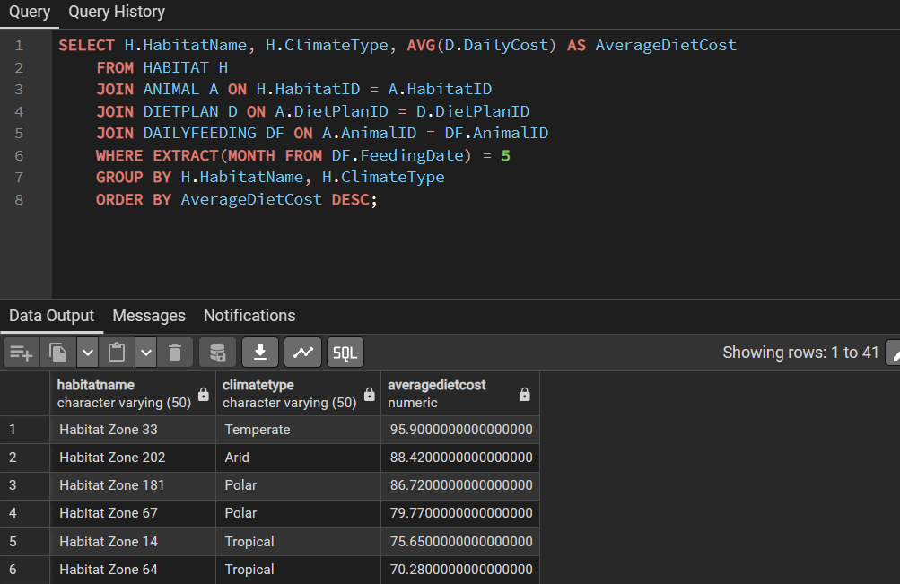
*   **Efficiency Analysis:** The JOIN method is significantly faster due to native subset hashing logic. Using an internal correlated SELECT sub-query generates an "N+1 Execution Flaw," running the calculation loop redundantly for every single Habitat outputted. 

---

**Double Query 4: Most frequent health status per species in 2024**  
**Description:** Find the most frequent health status for each animal species during the year 2024.

**Business Relevance:** Tracking the prevailing health trends across species enables the zoo to identify potential systemic issues, such as species-specific genetic vulnerabilities or environmental stressors.

**Scenario:** During the annual zoo performance review, the zoology department uses this data to prepare a health report for stakeholders, highlighting which species thrived and which might need modified care protocols.
*   **Version A (Window Function):**
    ```sql
    WITH StatusAgg AS (
        SELECT S.CommonName, HR.HealthStatus, COUNT(HR.RecordID) AS StatusOccurrences,
               EXTRACT(YEAR FROM HR.CheckupDate) AS CheckupYear
        FROM SPECIES S
        JOIN ANIMAL A ON S.SpeciesID = A.SpeciesID
        JOIN HEALTHRECORD HR ON A.AnimalID = HR.AnimalID
        GROUP BY S.CommonName, HR.HealthStatus, EXTRACT(YEAR FROM HR.CheckupDate)
    )
    SELECT CommonName, HealthStatus, StatusOccurrences FROM (
        SELECT CommonName, HealthStatus, StatusOccurrences,
               ROW_NUMBER() OVER(PARTITION BY CommonName ORDER BY StatusOccurrences DESC) as rn
        FROM StatusAgg
        WHERE CheckupYear = 2024
    ) Ranked
    WHERE rn = 1
    ORDER BY StatusOccurrences DESC;
    ```
*   **Version B (MAX Subquery in HAVING):**
    ```sql
    SELECT S.CommonName, HR.HealthStatus, COUNT(HR.RecordID) AS StatusOccurrences
    FROM SPECIES S
    JOIN ANIMAL A ON S.SpeciesID = A.SpeciesID
    JOIN HEALTHRECORD HR ON A.AnimalID = HR.AnimalID
    WHERE EXTRACT(YEAR FROM HR.CheckupDate) = 2024
    GROUP BY S.CommonName, HR.HealthStatus
    HAVING COUNT(HR.RecordID) = (
        SELECT MAX(Occurrences)
        FROM (
            SELECT COUNT(HR2.RecordID) AS Occurrences FROM ANIMAL A2
            JOIN HEALTHRECORD HR2 ON A2.AnimalID = HR2.AnimalID
            WHERE A2.SpeciesID = S.SpeciesID 
              AND EXTRACT(YEAR FROM HR2.CheckupDate) = 2024
            GROUP BY HR2.HealthStatus
        ) InnerAgg
    )
    ORDER BY StatusOccurrences DESC;
    ```
*   **Execution Screenshots:**
    > 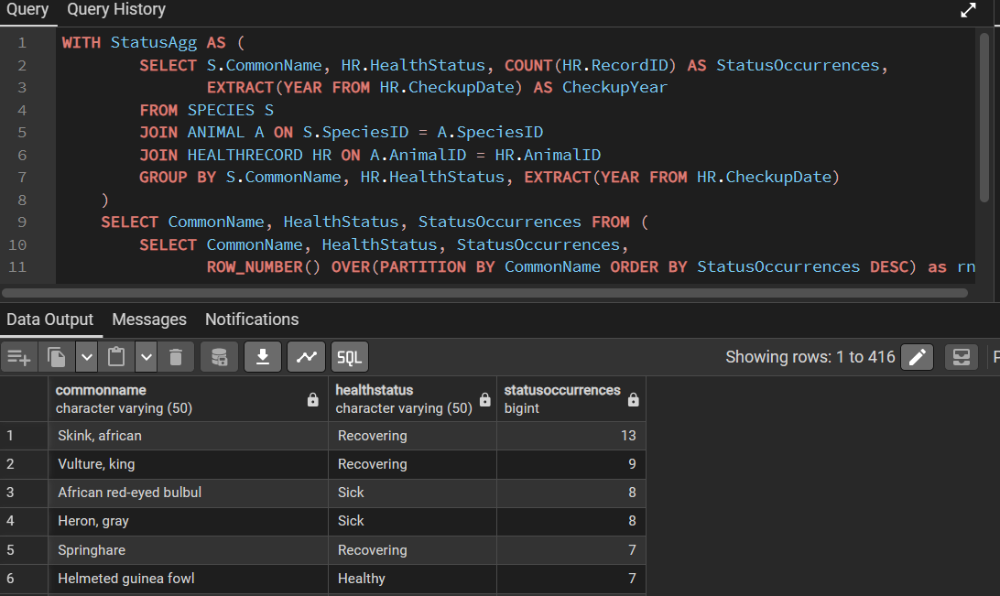
*   **Efficiency Analysis:** Window functions execute natively parsing datasets inside cache streams simultaneously whereas the `HAVING(MAX)` alternative brutally scans physical records iteratively multiple times representing atrocious algorithmic scaleability.

---

### 2. Additional SELECT Queries 

**Regular Query 1**
**Description:** Total daily diet cost per species, considering only animals that had a medical checkup in April.

**Business Relevance:** Correlating dietary costs with recent medical checkups helps assess whether specialized, potentially more expensive diets are being prescribed following routine medical evaluations.

**Scenario:** After the major spring checkup drive in April, the finance team investigates if the post-checkup diet plans have significantly inflated the feeding budget for certain species.
```sql
SELECT S.CommonName, S.ScientificName, SUM(D.DailyCost) AS TotalSpeciesDietCost
FROM SPECIES S
JOIN ANIMAL A ON S.SpeciesID = A.SpeciesID
JOIN DIETPLAN D ON A.DietPlanID = D.DietPlanID
JOIN HEALTHRECORD HR ON A.AnimalID = HR.AnimalID
WHERE EXTRACT(MONTH FROM HR.CheckupDate) = 4
GROUP BY S.CommonName, S.ScientificName
ORDER BY TotalSpeciesDietCost DESC;
```
> 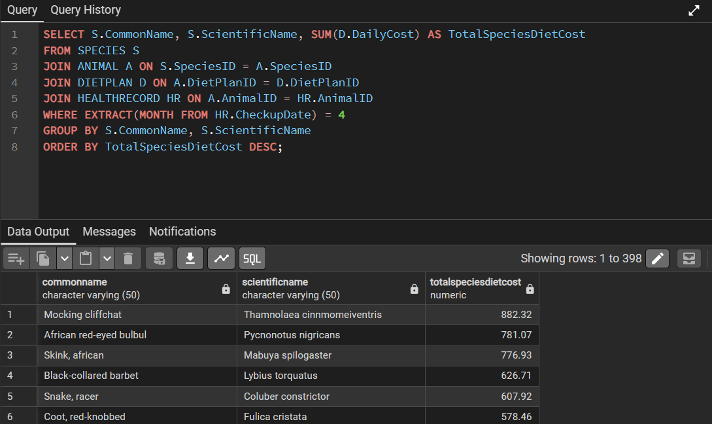

**Regular Query 2**
**Description:** Find the average capacity of habitats, grouped by climate type, for habitats where animals were fed on the 15th of any month.

**Business Relevance:** Analyzing habitat capacities based on climate helps in strategic planning for acquiring new animals and designing future enclosures.

**Scenario:** The zoo is considering acquiring new species that require specific climates. Management uses this query to evaluate the current average capacity of existing habitats (verified active via feeding logs) to determine where space is available.
```sql
SELECT H.ClimateType, S.CommonName, AVG(H.MaxCapacity) AS AvgCapacity
FROM HABITAT H
JOIN ANIMAL A ON H.HabitatID = A.HabitatID
JOIN SPECIES S ON A.SpeciesID = S.SpeciesID
JOIN DAILYFEEDING DF ON A.AnimalID = DF.AnimalID
WHERE EXTRACT(DAY FROM DF.FeedingDate) = 15
GROUP BY H.ClimateType, S.CommonName
ORDER BY AvgCapacity DESC;
```
> 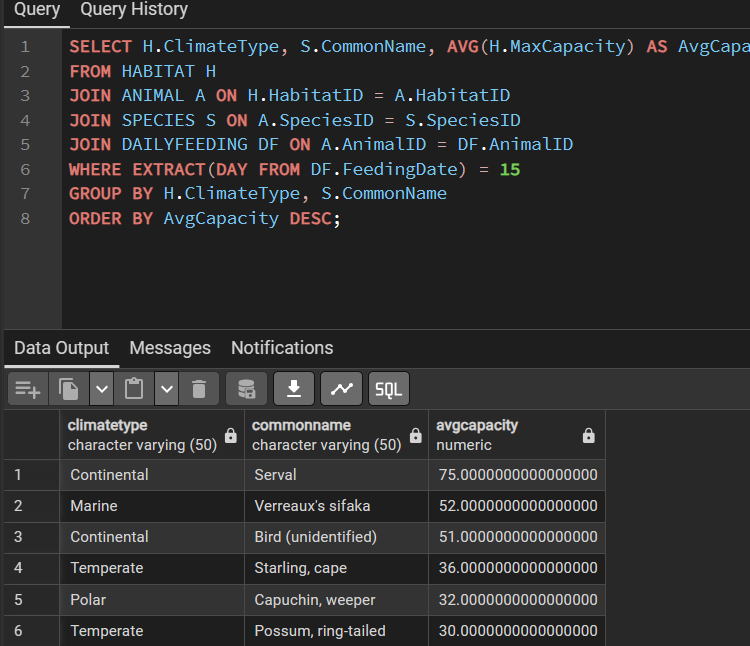

**Regular Query 3**
**Description:** Count the number of alive animals (not deceased) assigned to each diet plan, whose birth year is not 2020.

**Business Relevance:** Knowing exactly how many active animals rely on each diet plan is critical for supply chain management and negotiating bulk purchases with food vendors.

**Scenario:** The procurement manager is renegotiating annual contracts with suppliers and needs an accurate, up-to-date count of animals consuming each diet plan.
```sql
SELECT DP.PlanName, DP.DailyCost, COUNT(A.AnimalID) AS AssignedAnimalsCount
FROM DIETPLAN DP
JOIN ANIMAL A ON DP.DietPlanID = A.DietPlanID
JOIN HEALTHRECORD HR ON A.AnimalID = HR.AnimalID
WHERE EXTRACT(YEAR FROM A.DateOfBirth) <> 2020
  AND HR.HealthStatus <> 'Deceased'
GROUP BY DP.PlanName, DP.DailyCost
ORDER BY AssignedAnimalsCount DESC;
```
> 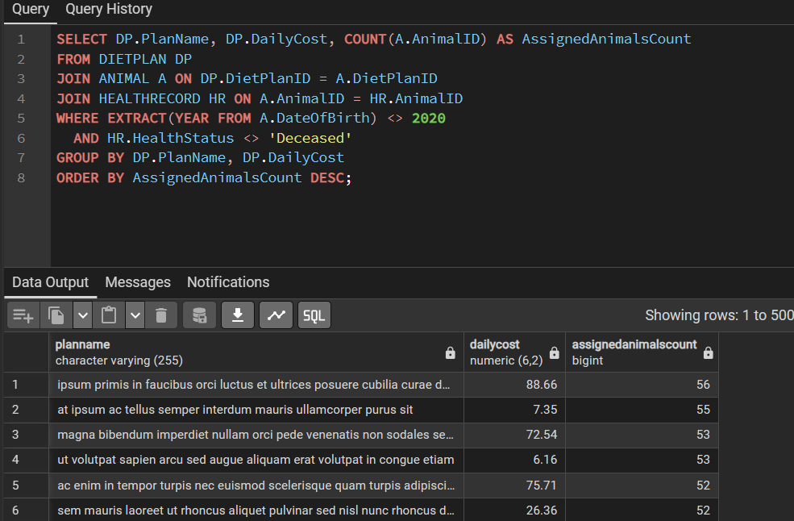

**Regular Query 4**
**Description:** Calculate the total weight measured in medical checkups conducted in December, grouped by habitats.

**Business Relevance:** Monitoring the aggregate weight of animals per habitat before winter helps adjust heating requirements, spatial planning, and seasonal dietary adjustments.

**Scenario:** In preparation for the peak of winter, the facility management team reviews total animal mass in various habitats to calibrate heating systems and ensure structural safety of indoor enclosures.
```sql
SELECT H.HabitatName, H.ClimateType, SUM(HR.Weight) AS TotalWeightRecorded
FROM HABITAT H
JOIN ANIMAL A ON H.HabitatID = A.HabitatID
JOIN HEALTHRECORD HR ON A.AnimalID = HR.AnimalID
WHERE EXTRACT(MONTH FROM HR.CheckupDate) = 12
GROUP BY H.HabitatName, H.ClimateType
ORDER BY TotalWeightRecorded DESC;
```
> 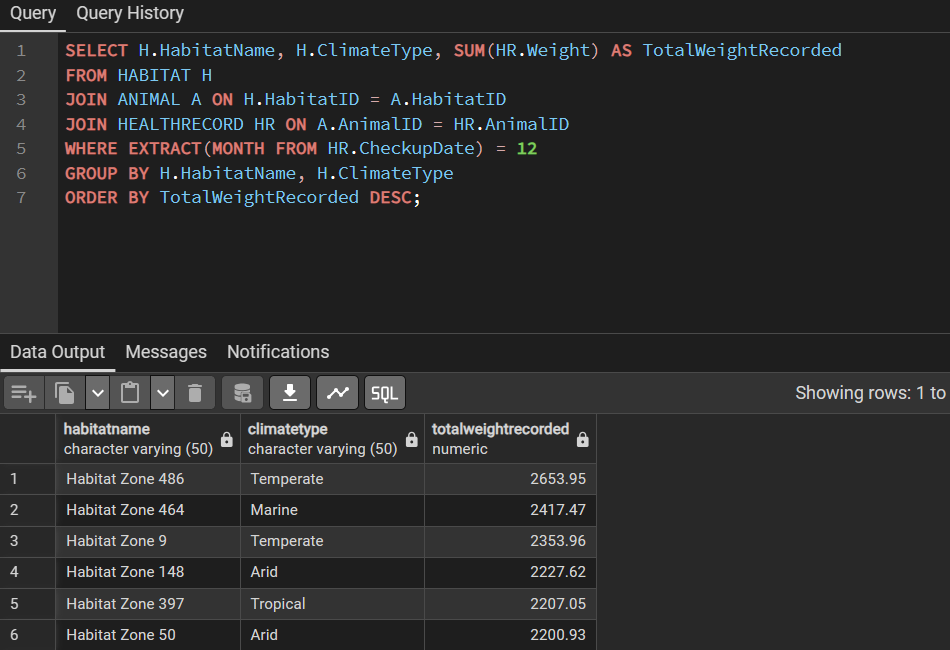

---

### 3. UPDATE & DELETE Queries 

#### UPDATE Queries
**UPDATE 1:** Increase daily cost by 15% for diet plans assigned to endangered animals.

**Business Relevance:** Ensures that the budget accurately reflects the premium costs of specialized conservation diets required for endangered species.

**Scenario:** A new international conservation directive mandates upgraded nutritional standards for endangered species. The finance department runs this update to immediately adjust the projected daily costs in the database by 15% to secure appropriate funding.
```sql
UPDATE DIETPLAN SET DailyCost = DailyCost * 1.15
WHERE DietPlanID IN (
    SELECT A.DietPlanID FROM ANIMAL A
    JOIN SPECIES S ON A.SpeciesID = S.SpeciesID
    WHERE S.ConservationStatus = 'Endangered'
);
```
>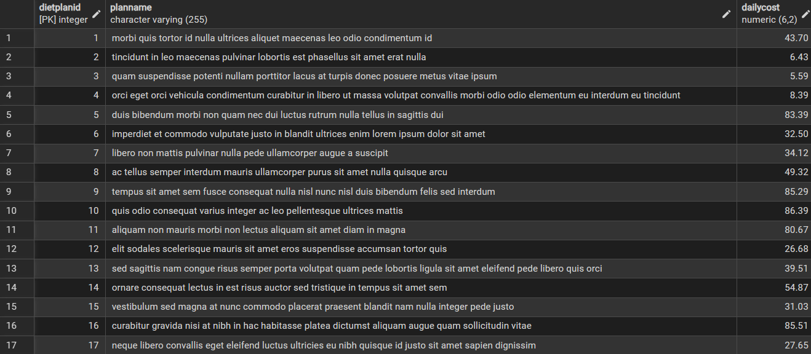 | 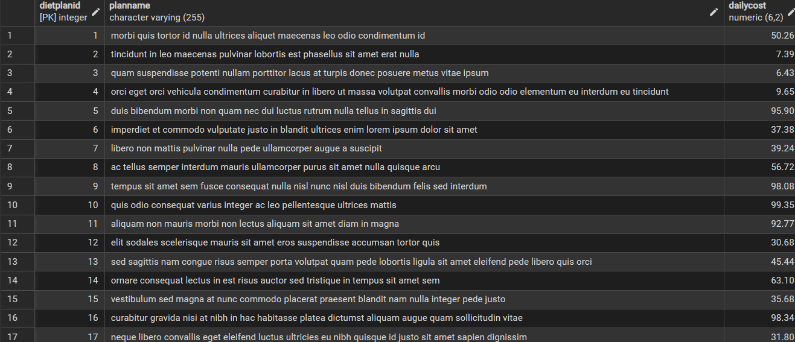
> 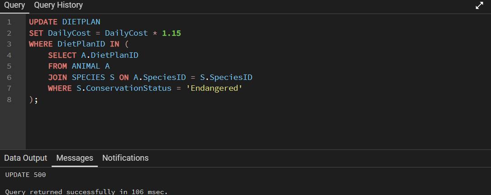


**UPDATE 2:** Transfer animals born before 2015 to the habitat with the largest maximum capacity.

**Business Relevance:** Proactively managing space for older animals improves their quality of life, reduces injury risks, and aligns with senior animal care standards.

**Scenario:** The zoo is undergoing renovations, and older animals (born before 2015) need more roaming space to mitigate arthritis and stress. Management runs this query to automatically reassign them to the most spacious enclosure available.
```sql
UPDATE ANIMAL SET HabitatID = (
    SELECT HabitatID FROM HABITAT ORDER BY MaxCapacity DESC LIMIT 1
)
WHERE EXTRACT(YEAR FROM DateOfBirth) < 2015;
```
> 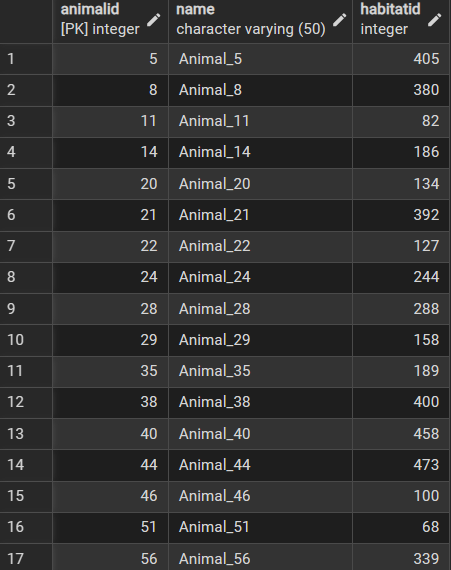 | 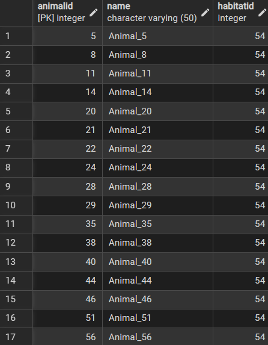
> 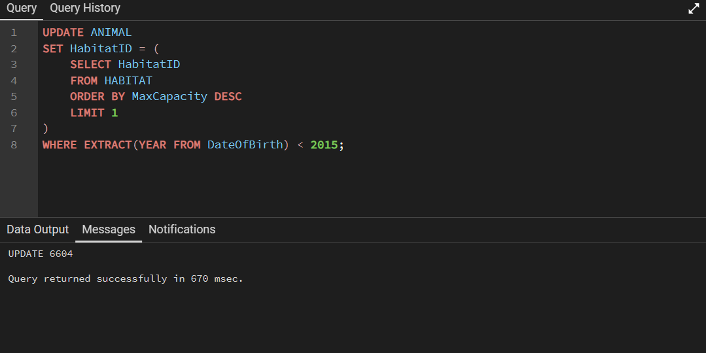

**UPDATE 3:** Update health status to 'Critical' for animals that consumed exceptionally low food quantities during the current month.

**Business Relevance:** Automating health alerts based on dietary intake ensures rapid medical response, preventing animal loss due to undetected illnesses.

**Scenario:** To prevent human error in monitoring thousands of animals, the system automatically flags any animal eating dangerously low amounts as 'Critical', instantly triggering an emergency veterinary checkup alert.
```sql
UPDATE HEALTHRECORD SET HealthStatus = 'Critical'
WHERE AnimalID IN (
    SELECT DF.AnimalID FROM DAILYFEEDING DF
    WHERE DF.FoodConsumedQty < 2.0 AND EXTRACT(MONTH FROM DF.FeedingDate) = EXTRACT(MONTH FROM CURRENT_DATE)
);
```
> 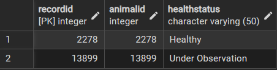 | 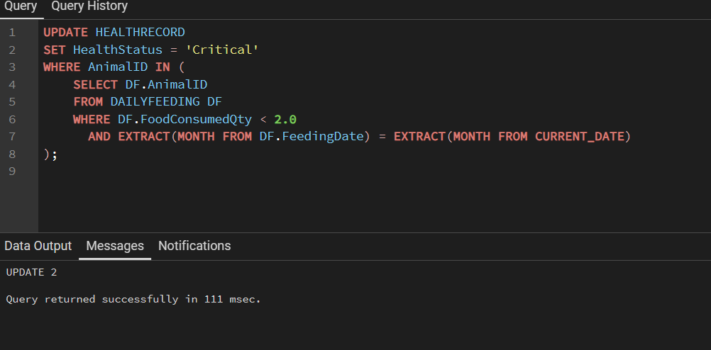
> 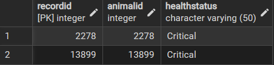

#### DELETE Queries
**DELETE 1:** Delete feeding records from previous years for animals located in 'Continental' climate habitats.

**Business Relevance:** Routine data archiving/purging optimizes database performance and reduces cloud storage costs by removing obsolete operational data.

**Scenario:** The IT department conducts its annual database cleanup. Since Continental habitats had a standardized diet last year that is no longer medically relevant, they purge old feeding logs to free up database index space and speed up daily queries.
```sql
DELETE FROM DAILYFEEDING
WHERE EXTRACT(YEAR FROM FeedingDate) < EXTRACT(YEAR FROM CURRENT_DATE)
  AND AnimalID IN (
      SELECT A.AnimalID FROM ANIMAL A
      JOIN HABITAT H ON A.HabitatID = H.HabitatID WHERE H.ClimateType = 'Continental'
  );
```
> 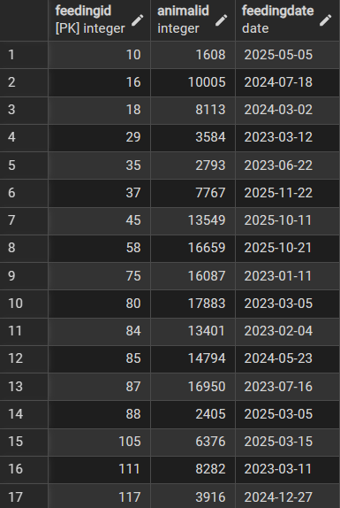 |
> 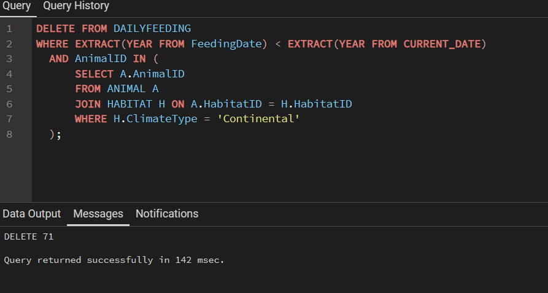

**DELETE 2:** Delete health records of animals that consumed less than 10 food units in recent years.

**Business Relevance:** Cleaning up anomalous or corrupted historical records ensures that longitudinal health analytics and ML models are not skewed by bad data.

**Scenario:** A data audit reveals that a faulty scale previously recorded impossibly low food consumption (<10 units over a year). Data engineers run this query to delete these corrupted historical health records to maintain data integrity for future research.
```sql
DELETE FROM HEALTHRECORD
WHERE AnimalID IN (
    SELECT AnimalID FROM DAILYFEEDING 
    WHERE FoodConsumedQty < 10 AND EXTRACT(YEAR FROM FeedingDate) < EXTRACT(YEAR FROM CURRENT_DATE)
);
```
> 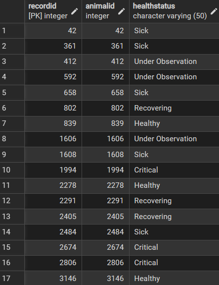 | 
> 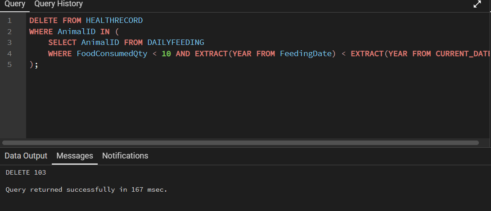

**DELETE 3:** Delete daily feeding records from the first quarter (January-March) for animals in 'Arid' climate habitats.

**Business Relevance:** Facilitates legal compliance with data retention policies regarding seasonal experimental diets that must be purged after evaluation.

**Scenario:** The zoo completed a 3-month experimental winter diet study in the Arid zones. Following the study's conclusion and external publication, the research agreement requires purging the granular daily feeding logs from that specific quarter to comply with data privacy policies of the partner institute.
```sql
DELETE FROM DAILYFEEDING
WHERE EXTRACT(MONTH FROM FeedingDate) IN (1, 2, 3)
  AND AnimalID IN (
      SELECT A.AnimalID FROM ANIMAL A
      JOIN HABITAT H ON A.HabitatID = H.HabitatID 
      WHERE H.ClimateType = 'Arid'
  );
```
> 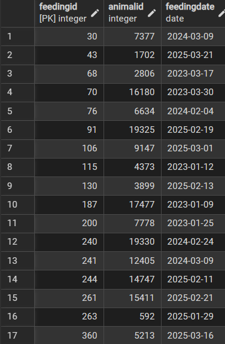 | 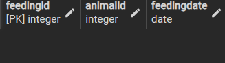
> 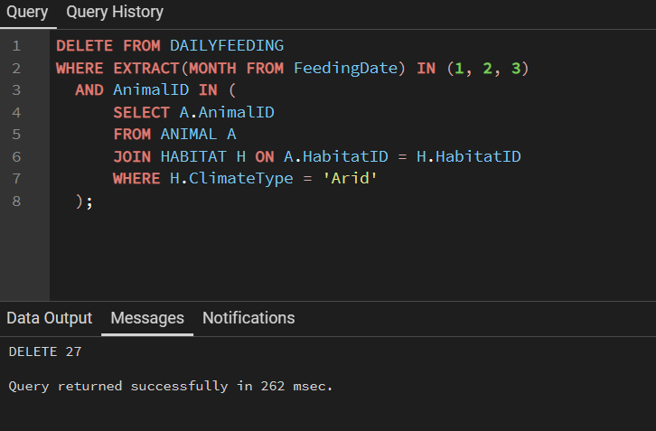

---

### 4. Constraints 

**Constraint 1: `check_dob_past`**
**Change Description:** An ALTER TABLE constraint ensuring that an animal's date of birth cannot be in the future.
```sql
ALTER TABLE ANIMAL ADD CONSTRAINT check_dob_past CHECK (DateOfBirth <= CURRENT_DATE);
```
**Violation Test:** 
```sql
INSERT INTO ANIMAL (AnimalID, Name, DateOfBirth, Gender, HabitatID, SpeciesID, DietPlanID)
VALUES (9999, 'Future Animal', CURRENT_DATE + INTERVAL '10 days', 'Male', 1, 1, 1);
```
> 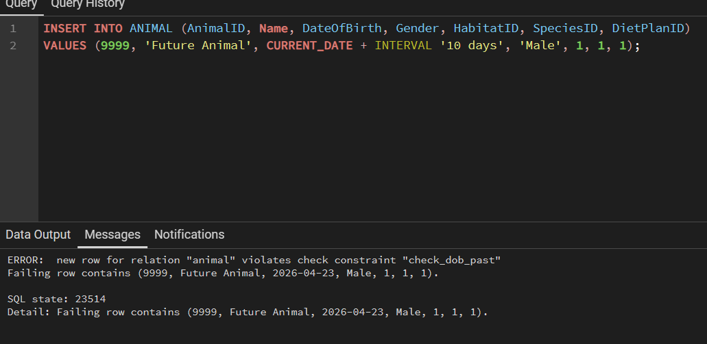

**Constraint 2: `check_valid_status`**
**Change Description:** Restricting 'HealthStatus' values to an authorized set only, in order to prevent typos.
```sql
ALTER TABLE HEALTHRECORD ADD CONSTRAINT check_valid_status CHECK (HealthStatus IN ('Healthy', 'Sick', 'Recovering', 'Critical', 'Deceased'));
```
**Violation Test:** 
```sql
INSERT INTO HEALTHRECORD (RecordID, CheckupDate, Weight, HealthStatus, AnimalID)
VALUES (9999, CURRENT_DATE, 50.0, 'Super Healthy', 1);
```
> 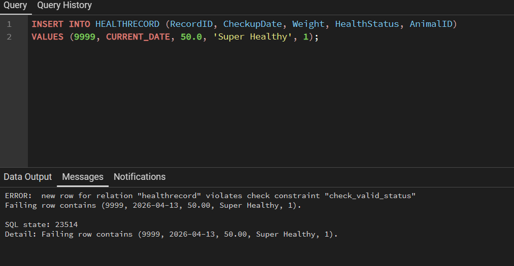

**Constraint 3: `check_feeding_past`**
**Change Description:** A constraint preventing the insertion of future feeding dates into the daily feeding records table, contrary to time logic.
```sql
ALTER TABLE DAILYFEEDING ADD CONSTRAINT check_feeding_past CHECK (FeedingDate <= CURRENT_DATE);
```
**Violation Test:** 
```sql
INSERT INTO DAILYFEEDING (FeedingID, FeedingDate, FoodConsumedQty, AnimalID)
VALUES (9999, CURRENT_DATE + INTERVAL '5 days', 10.0, 1);
```
> 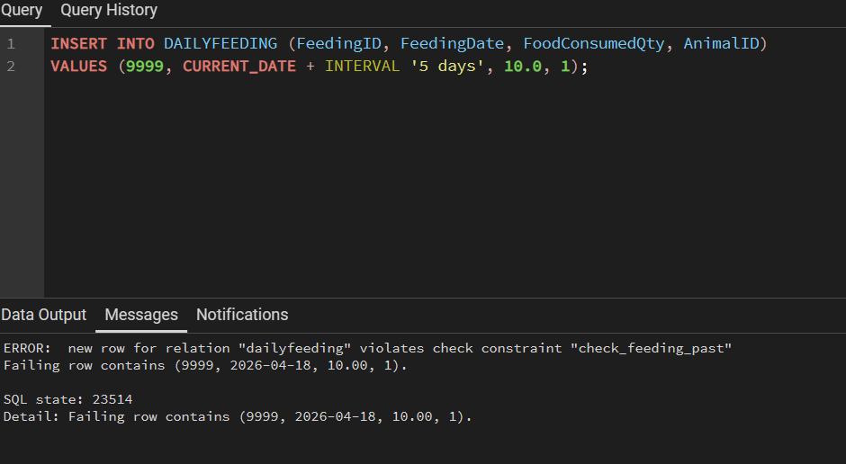

---

## 8. Phase C: Integration (Veterinary Dept)

### 8.1 New Department Details
As part of the integration phase, our zoo received the database of the **Veterinary Clinic**.
The new department's DSD diagram prior to integration:

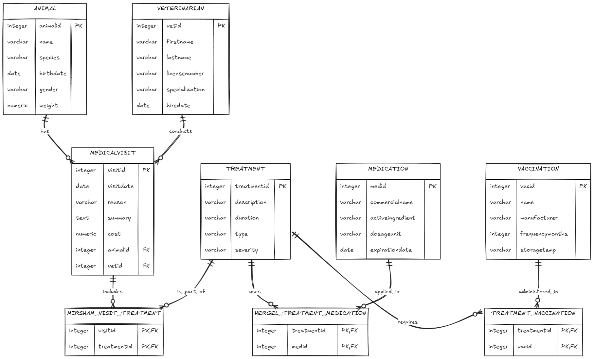

### 8.2 Reverse Engineering Algorithm (Reverse Engineering Algorithm)
To generate the ERD from the new department's database tables, we performed reverse engineering according to the following steps:
1. ****Entity Identification:**** Every regular table in the system (like `animal`, `veterinarian`, `treatment`) was converted to a basic entity in the ERD.
2. ****Primary Key Identification:**** Columns defined as PK in each table were marked as key attributes in the ERD.
3. ****Attribute Identification:**** The remaining columns (such as `name`, `birthdate`) were associated with their respective entities.
4. ****Relationships and Foreign Keys Identification:****
   - **1:N Relationships** - located using foreign keys (e.g. `animalid` inside the `medicalvisit` table pointing to `animal`).
   - **M:N Relationships** - identified by junction tables consisting of composite keys (such as `mirsham_visit_treatment`). In the ERD, the junction tables were converted back into many-to-many relationships, or presented as associative entities.
5. ****Visual Drawing and Translation:**** All entities were linked according to the business logic derived from the types of foreign keys, including the marking of participation constraints.

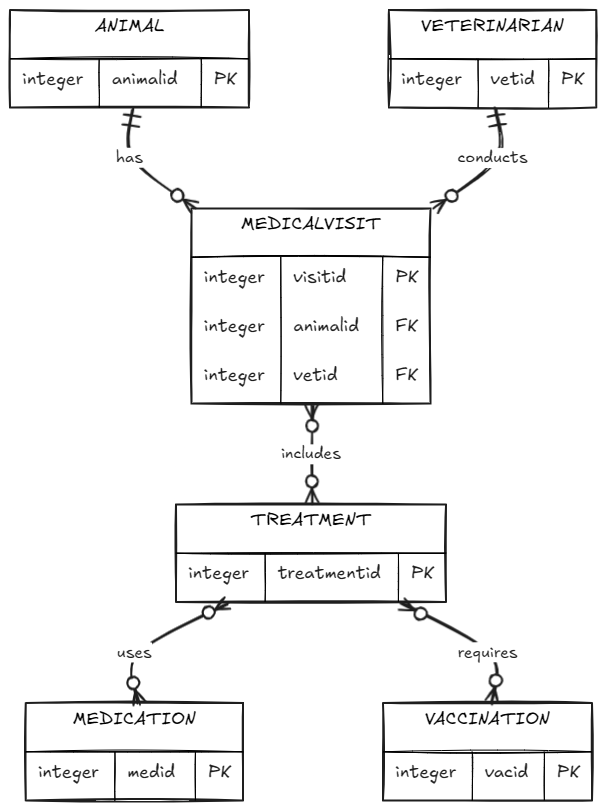

### 8.3 Integration Decisions & Merged ERD
During the merger of the veterinary department into our zoo, we made the following decisions:
- ****Unification of the ANIMAL entity:**** We decided to drop the `animal` table of the veterinary clinic and use the comprehensive `ANIMAL` table we created in previous stages. The `MEDICALVISIT` table was modified and its foreign key `AnimalID` now points to our existing animal table.
- ****Separation of Roles - VETERINARIAN:**** We chose to keep the veterinarian entity separate (rather than merge with `EMPLOYEE`) since they have many unique attributes (such as a special license number and medical specialization).
- ****Introduction of Clinical Tables:**** We created the tables `MEDICALVISIT`, `TREATMENT`, `MEDICATION`, and `VACCINATION` along with their junction tables, but updated their names and data types to match the coding standard of our system.
- ****Creation of ALTER Commands:**** Instead of deleting the existing database, we used `ALTER TABLE ... ADD CONSTRAINT` commands in the `Integrate.sql` file to implement the integration while adding foreign keys that connect the two worlds.

ERD


Merged DSD
.png>)

### 8.4 Views & Queries (Views & Queries)
Three views were created to reflect the integrated system (available in the `Views.sql` file).

#### 1. Original Department View - `View_Zoo_Animal_Status`
**Description:** Displays the status of the animals in the zoo, including their species, the habitat they reside in, the diet plan, and the health status from their last checkup.


**Query 1: Display animals not in a Healthy state**
**Description:** Shows only animals requiring observation.

**Business Relevance:** Immediate identification of sick or recovering animals is paramount for preventing cross-contamination and providing timely medical intervention, reducing mortality rates.

**Scenario:** Every morning, the head zookeeper runs this query to generate a priority watch-list, ensuring that staff allocate extra time to monitor and care for these specific animals during their shifts.

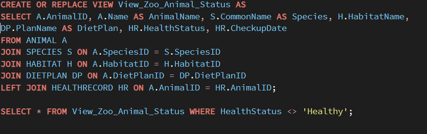

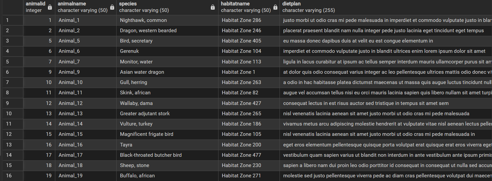

**Query 2: Count animals by Habitat**
**Description:** Finds how many animals exist in each habitat based on the view.

**Business Relevance:** Maintaining optimal animal density in habitats prevents overcrowding, reduces stress-induced aggression, and complies with spatial welfare standards.

**Scenario:** The animal relocation committee uses this report during their weekly meetings to decide if certain fast-breeding populations need to be transferred to other enclosures or partner zoos to avoid exceeding capacity.

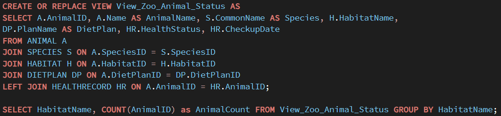

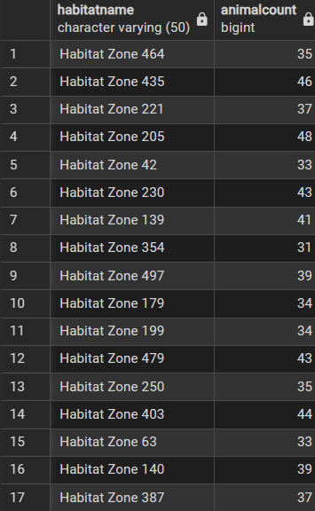

#### 2. New Department View - `View_Vet_Clinic_Activity`
**Description:** Focuses on veterinarian activity. Shows each medical visit, the treating veterinarian, reason for visit, and the medical or drug treatment given (including treatment severity).


**Query 1: Medium and High Severity Treatments**
**Description:** Retrieves visits that required significant intervention (Medium, High, Critical).

**Business Relevance:** Auditing severe medical cases allows the clinic to evaluate the quality of care, manage inventory of critical medical supplies, and justify veterinary budget requests.

**Scenario:** At the end of the month, the Chief of Veterinary Medicine reviews this list to ensure that all critical cases received appropriate follow-up care and to assess if there is an unusual spike in severe injuries indicating a safety hazard.

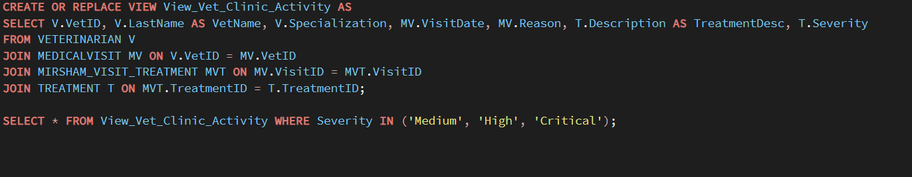

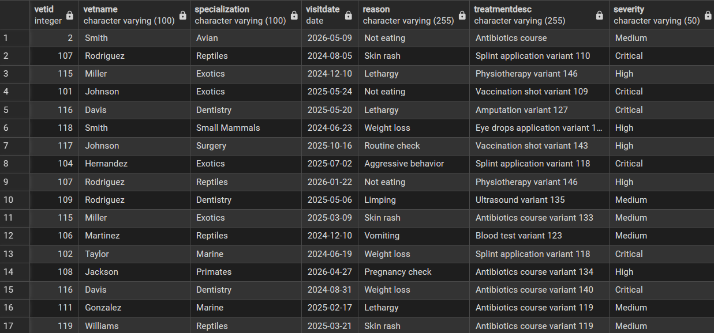

**Query 2: Number of treatments performed by each veterinarian**

**Description:** Groups and counts the number of medical procedures provided by each doctor in the clinic.

**Business Relevance:** Tracking individual veterinary workload ensures fair labor distribution, helps in performance evaluations, and highlights staffing shortages.

**Scenario:** The HR department and Clinic Director use this metric during quarterly reviews to determine if a specific veterinarian is overburdened and whether the clinic needs to hire additional specialized staff.

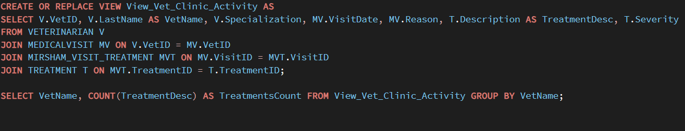

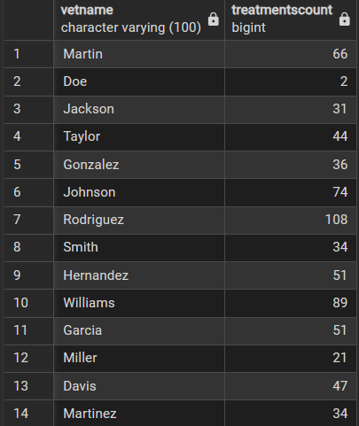

#### 3. Integrated View - `View_Integrated_Animal_Medical`
**Description:** The most comprehensive view. Combines the animal's personal data from the original department with the complete history of visits, treatments, medications, and vaccinations from the veterinary department.

**Query 1: Medical Profile for a specific animal**
**Description:** Retrieves the entire medical file for a specific AnimalID.

**Business Relevance:** Instant access to an animal's comprehensive medical history is essential for making accurate diagnoses and avoiding dangerous drug interactions during emergencies.

**Scenario:** An animal is unexpectedly found unconscious in its enclosure. The responding veterinarian instantly pulls this profile to check past illnesses, current medications, and allergies before administering emergency treatment.


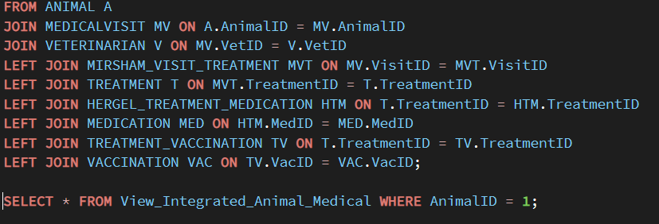

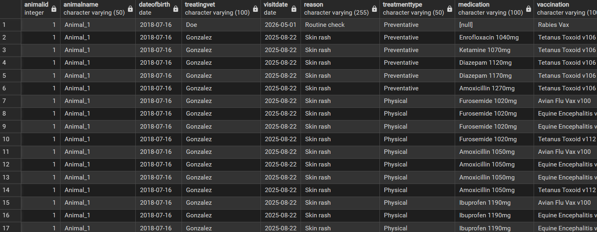


**Query 2: Vaccination Tracking**
**Description:** Displays all animals that received vaccinations in the clinic, the date the vaccination was given, and the type of vaccination.

**Business Relevance:** Strict vaccination tracking is a legal requirement for zoo licensing, prevents devastating viral outbreaks, and ensures the safety of both animals and interacting staff.

**Scenario:** During an annual health and safety inspection by external regulators, the zoo administration uses this query to provide immediate proof of compliance with mandated animal vaccination protocols.

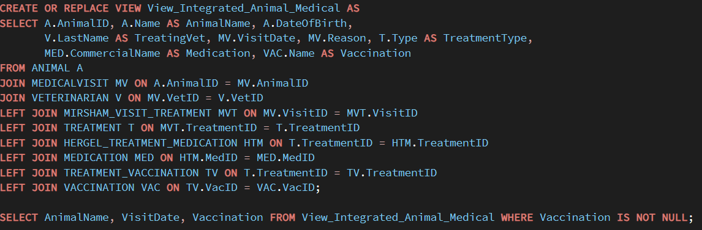

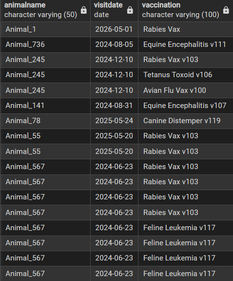

---

## 9. Phase D: Programming (PL/pgSQL)

In this phase, we implemented advanced database programming using PL/pgSQL to automate processes, enforce complex business logic, and perform automated database management tasks.

### 9.1 Functions

#### Function 1: `Get_Habitat_Diet_Cost`
**Description:** Calculates the total daily dietary cost for all animals residing in a specific habitat. It utilizes an explicit cursor to loop through all animals in the habitat, fetches their diet plan IDs, and uses an implicit cursor to retrieve the cost.

**Scenario:** The zoo's financial planning department needs to estimate the total daily dietary budget required for all animals living within a specific enclosure (e.g., the Savannah) to optimize upcoming bulk food purchases.
- **Programming Elements:** Explicit Cursor, Loop, Branching (IF/THEN), Exception Handling, Implicit Cursor, Records, DML.
- **Code Reference:** `Function_GetHabitatDietCost.sql`

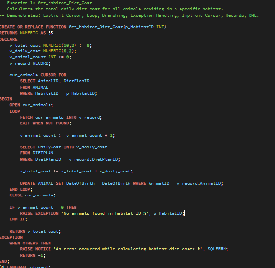

> 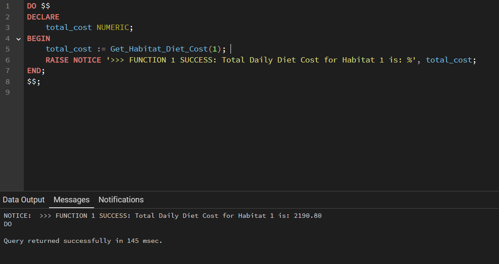

#### Function 2: `Get_Animals_By_Vet_RefCursor`
**Description:** Returns a Ref Cursor containing a list of animals treated by a specific veterinarian. It validates the vet's existence and then opens a cursor pointing to the complex join query.

**Scenario:** The head veterinarian needs to quickly pull a full list of all animals historically treated by a specific junior vet to audit the quality of their medical diagnoses during an annual performance review.
- **Programming Elements:** Ref Cursor, Branching, Exception Handling, Explicit/Implicit Cursors, Loops, Records, DML.

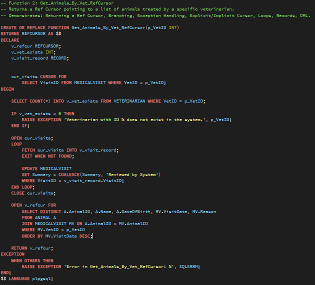

> 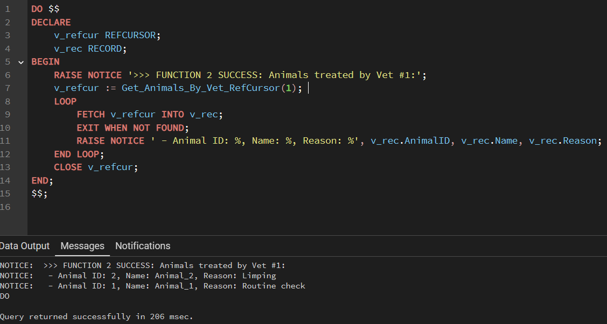

### 9.2 Procedures

#### Procedure 1: `Process_Routine_Checkups`
**Description:** Automatically generates a new 'Healthy' health record for animals that have not had a checkup in over a year. It finds their last known weight and creates a new checkup record with the current date.

**Scenario:** To ensure compliance with international animal welfare standards, the system automatically creates baseline routine health checkups for any animal that slipped through the cracks and wasn't examined by staff in the past 12 months.
- **Programming Elements:** DML (INSERT), Implicit Cursor, Explicit Cursor, Records, Loop, Exception Handling, Branching, Ref Cursor.

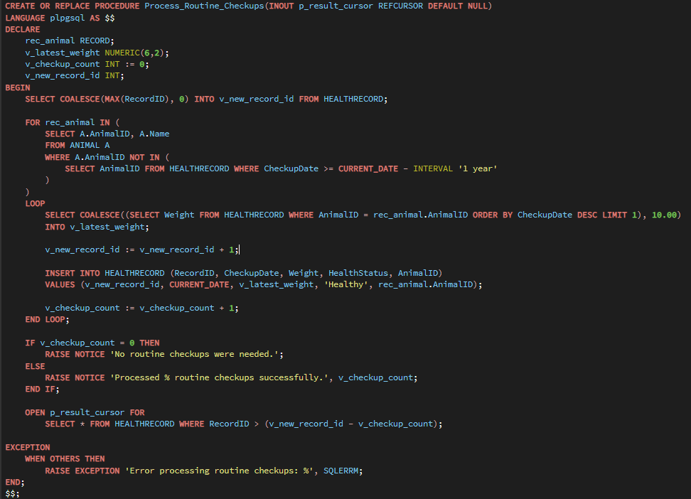

> 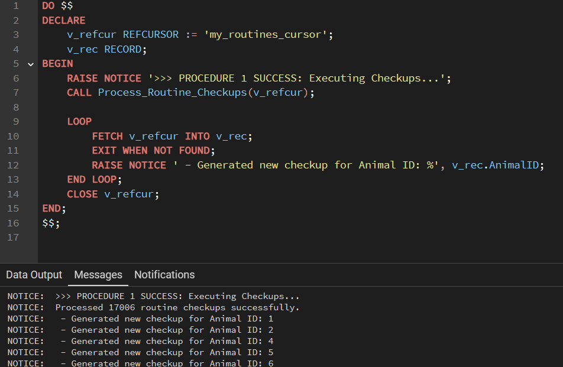

#### Procedure 2: `Adjust_Diet_Cost_By_Species`
**Description:** Increases the daily cost of diet plans for all animals of a specific species by a percentage parameter. It uses a cursor to find all distinct diet plans associated with the species and updates them.

**Scenario:** A sudden supply chain shortage increases the market price of specialized imported bamboo. The procurement team uses this procedure to instantly inflate the daily dietary costs of all pandas by a set percentage across the board.
- **Programming Elements:** DML (UPDATE), Explicit/Implicit Cursors, Records, Loop, Branching, Exception Handling, Ref Cursor.

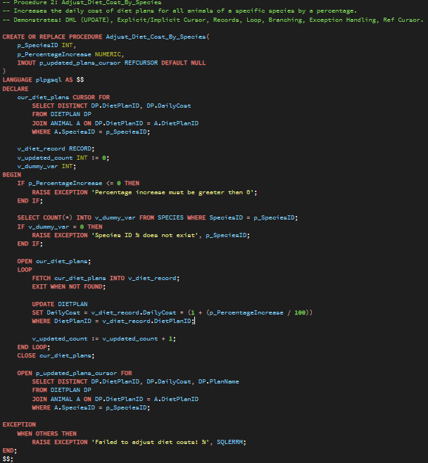

> 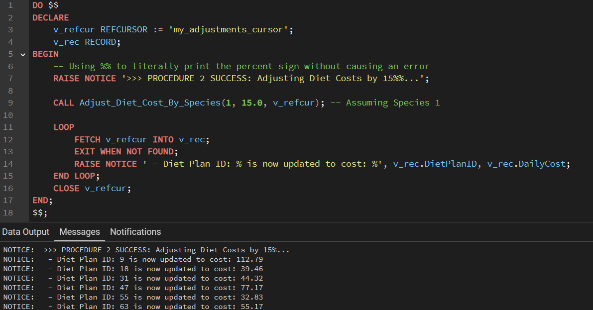

### 9.3 Triggers

#### Trigger 1: `Trg_Prevent_Invalid_Medical_Cost` (BEFORE UPDATE)
**Description:** Validates modifications to the `MEDICALVISIT` table. It ensures that costs cannot be negative, and if a cost is significantly increased (to > 500), it requires the veterinarian to provide a detailed summary of the visit, otherwise it raises an exception.

**Scenario:** A vet mistakenly enters a routine checkup cost as $5000 instead of $50. The system automatically blocks the transaction, demanding a detailed medical summary to justify the unusually high expense, thereby preventing financial data entry anomalies.
- **Programming Elements:** Trigger on UPDATE, Branching, Exceptions.

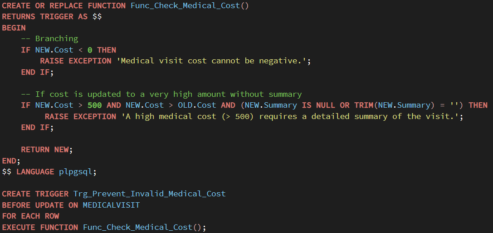

> 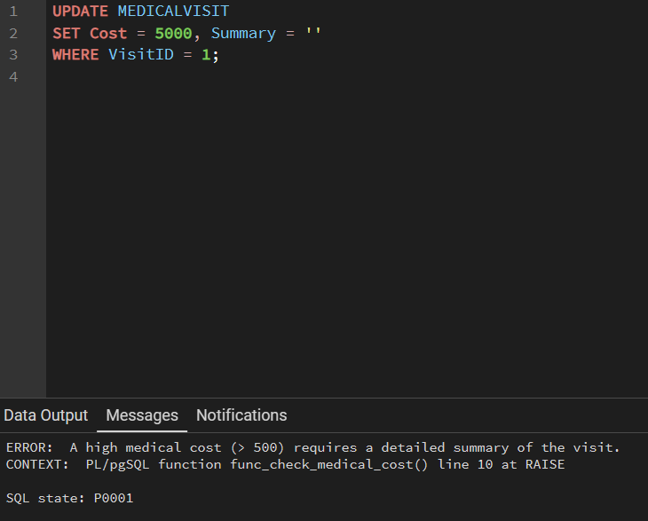

#### Trigger 2: `Trg_Habitat_Capacity_Log` (AFTER UPDATE)
**Description:** Logs any changes made to the `MaxCapacity` of a habitat into a dedicated auditing table (`HABITAT_CAPACITY_LOG`). This is crucial for tracking structural changes to enclosures.

**Scenario:** The engineering team expands the physical capacity of the aquatic habitat. The system transparently logs this structural upgrade into an audit table, providing zoo management with a historical track record of facility growth over time.
- **Programming Elements:** Trigger on UPDATE, DML (INSERT).

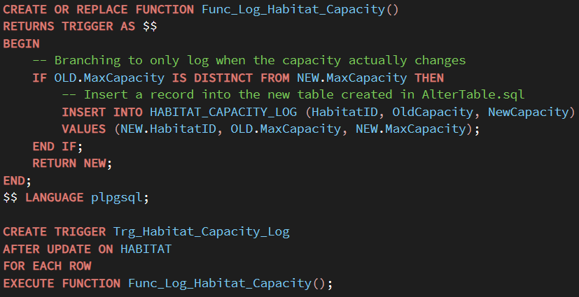


> 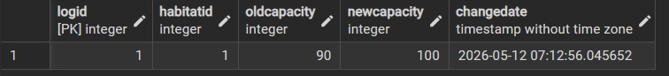

### 9.4 Main Programs

We created two main PL/pgSQL anonymous blocks to demonstrate and test the execution of our functions and procedures.

**Main Program 1:** 
Calls the `Process_Routine_Checkups()` procedure to ensure all outdated health records are updated, and then calls `Get_Habitat_Diet_Cost(1)` to analyze the resulting financial impact on Habitat #1.

**Scenario:** At the start of the fiscal year, the zoo director runs this automated management script that simultaneously updates all lagging health records to baseline standards, and immediately calculates the new dietary cost overhead for the primary habitat to ensure enough funds are allocated for the upcoming quarter.

> 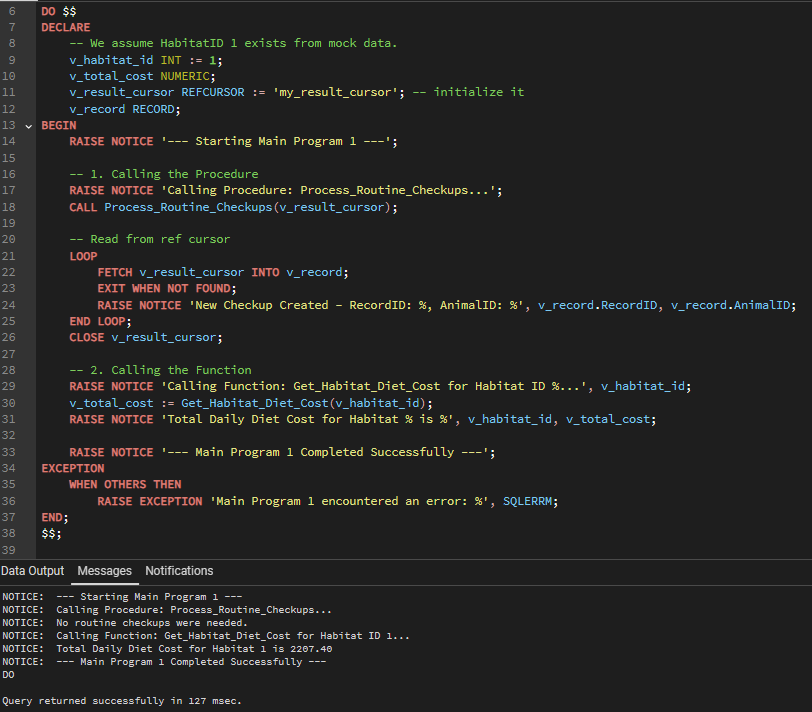

**Main Program 2:** 
Executes `Adjust_Diet_Cost_By_Species(1, 10.5)` to increase dietary costs due to inflation, and then opens and iterates through the Ref Cursor generated by `Get_Animals_By_Vet_RefCursor(1)` to log all animals treated by Vet #1.

**Scenario:** Due to a sudden national vendor price hike, the accounting department bulk-adjusts the feed costs for a specific species by 10.5%. Simultaneously, they pull a cross-referenced medical history report from the treating veterinarian to ensure the budget adjustments won't negatively impact the animals currently undergoing medical care.

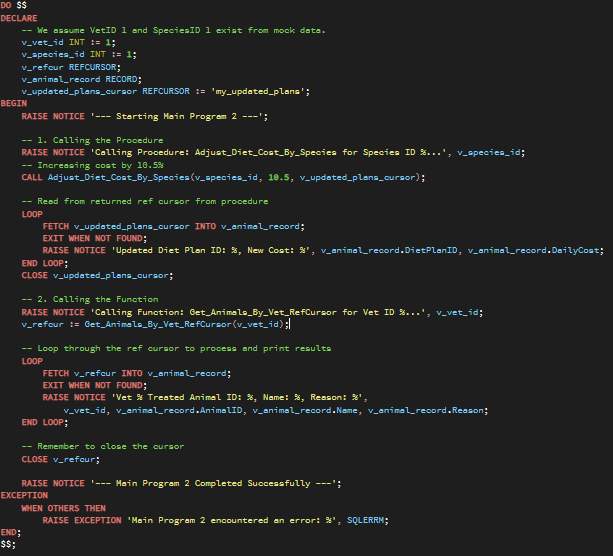

> 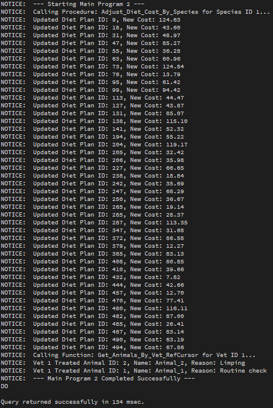
