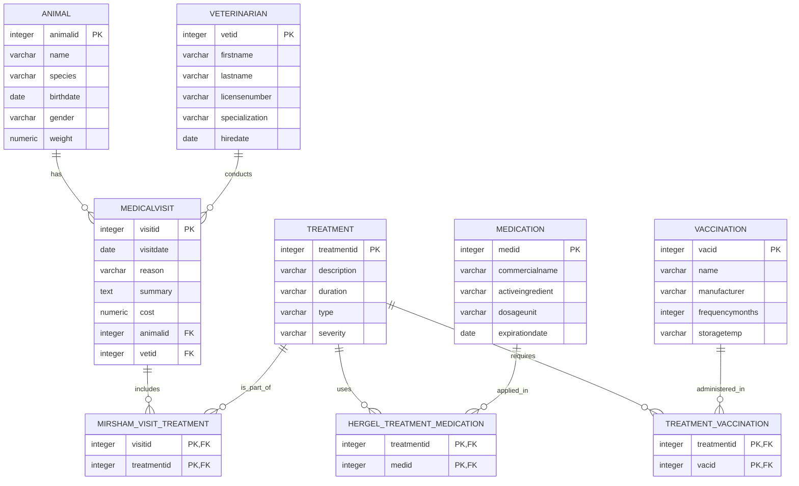
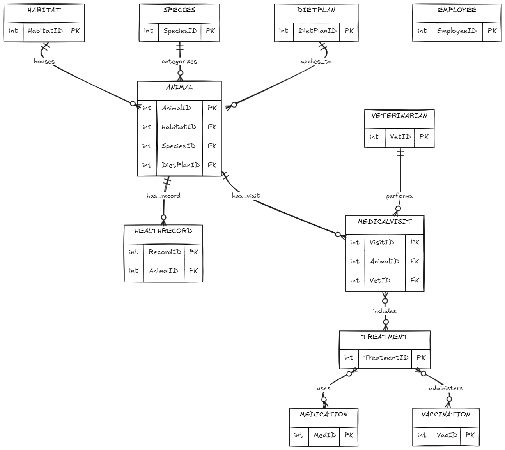
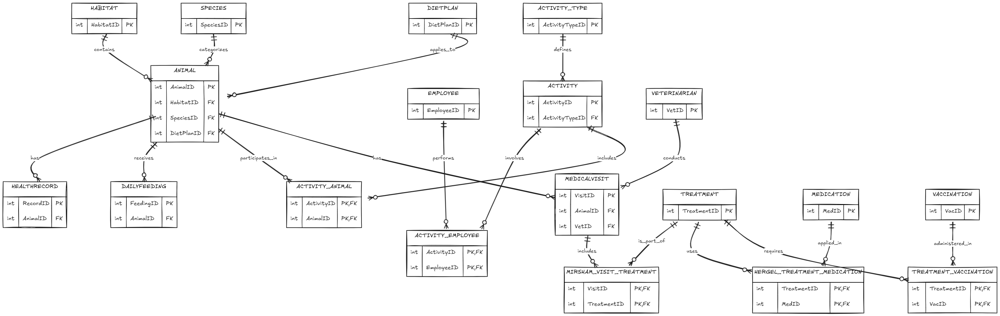

# Stage A Project Report

<div align="center">

## Zoo Animal Management System

**Submitted by:**  
Yedidya Bar-Gad & Yuval Schmidet

</div>

---

## Table of Contents
1. [Introduction (System Overview)](#1-introduction-system-overview)
2. [User Interface (AI Studio)](#2-user-interface-ai-studio)
3. [Database Diagrams](#3-database-diagrams)
4. [Design Decisions & Justifications](#4-design-decisions--justifications)
5. [Data Population Methods](#5-data-population-methods)
6. [Backup & Restore Operations](#6-backup--restore-operations)
7. [Phase B: Queries and Constraints](#7-phase-b-queries-and-constraints)
   * [Dual-Form SELECT Queries](#1-dual-form-select-queries)
   * [Additional SELECT Queries](#2-additional-select-queries)
   * [UPDATE & DELETE Queries](#3-update--delete-queries)
   * [Constraints](#4-constraints)
8. [Phase C: Integration (Veterinary Dept)](#8-phase-c-integration-veterinary-dept)

---

## 1. Introduction (System Overview)

The **Zoo Animal Management System** is a comprehensive relational database designed to manage and track the critical operations of a modern zoological facility. Its primary functionality revolves around recording detailed information regarding the zoo's animal population, their living environments, dietary requirements, and ongoing health statuses. 

The system stores interconnected data across several key domains:
*   **Animals and Species:** Tracking individual animals (their birth dates, gender, etc.) alongside their broader species classifications and conservation statuses.
*   **Habitats:** Managing the various enclosure zones, their specific climate types, and maximum holding capacities.
*   **Medical and Dietary Management:** Logging periodic health checkups, recording animal weights and health statuses over time, as well as assigning specific nutritional diet plans and tracking daily food consumption metrics.
*   **Staff and Activities:** Managing zoo personnel logging capabilities alongside a Many-to-Many activity tracking layer mapping employees and animals to assigned daily activity logs (shows, training occurrences, facility procedures) via dedicated junction tables.

---

## 2. User Interface (AI Studio)

This section presents the initial mockups and user interface screens designed to interact with the database, allowing users to efficiently retrieve, insert, and update system records.


**Interactive Prototype:**  
https://ai.studio/apps/2c40fd05-35c4-457c-aa3e-f2515040b0b5

---

## 3. Database Diagrams

The architectural design of the database is visualized in the following diagrams, illustrating the entities, their attributes, and the relational mapping between them.

**Entity Relationship Diagram (ERD)**  


**Data Structure Diagram (DSD)**  


## 4. Design Decisions & Justifications

When building the database schema, several major design choices were made to ensure data integrity, eliminate redundancy, and adhere to the Third Normal Form (3NF) principles:

*   **Normalization to 3NF:** The database was rigorously normalized to prevent insert, update, and delete anomalies. For instance, rather than storing `CommonName`, `ScientificName`, and `ConservationStatus` directly inside the `ANIMAL` table, these attributes were extracted into a distinct `SPECIES` table. This ensures that species-level information is stored exactly once, reducing redundancy.
*   **Separation of Diet Plans:** Similarly, nutritional requirements are managed via a separated `DIETPLAN` table. This allows multiple animals to share the same standardized diet plan without continuously duplicating the `DailyCost` and `PlanName` attributes across the `ANIMAL` records.
*   **Historical Tracking through Composite Entities:** 
    *   The `HEALTHRECORD` table is separated from the `ANIMAL` table in a 1-to-Many relationship. This decision was deliberately made to maintain a historical log of an animal's health status and weight over time (utilizing `CheckupDate`), rather than merely overwriting a single current health status field.
    *   The `DAILYFEEDING` table acts in a similar capacity, providing a granular, longitudinal record of actual `FoodConsumedQty` per date. This allows the zoo to track dietary analytics and detect consumption anomalies over time.
*   **Many-to-Many Interconnectivity (Activity Layer):** Rather than limiting an activity occurrence to a single animal or single employee, the schema actively utilizes strict Third Normal Form (3NF) relational junction tracking (`ACTIVITY_EMPLOYEE` and `ACTIVITY_ANIMAL`). This allows dynamic logging mappings (e.g. 3 animals and 5 veterinarians involved in exactly 1 operation) safely without relying on unstable arrays or comma-delineated blocks while assuring flawless Foreign Key adherence.
*   **Data Integrity Constraints:** Strict `CHECK` constraints (e.g., `MaxCapacity > 0`, `Weight > 0`, `FoodConsumedQty >= 0`) and `NOT NULL` constraints have been enforced at the schema level to guarantee that only valid, logical data enters the system.

---

## 5. Data Population Methods

To thoroughly stress-test the schema and simulate a production-grade environment, we utilized three distinct methodologies to populate the database tables, fulfilling the requirement of having a massive dataset:

1.  **Algorithmic Data Generation (Python Script):**  
    We developed a custom Python script (`generate_data.py`) using the `csv` and `datetime` libraries to programmatically generate **20,000 records** for the `ANIMAL` and `HEALTHRECORD` tables. During the latest iteration, it was also upgraded to dynamically generate relational 500-record mock CSVs mapping our new architectural layer: `EMPLOYEE`, `ACTIVITY_TYPE`, `ACTIVITY`, alongside executing mathematically randomized Multi-to-Multi bridge links for `ACTIVITY_EMPLOYEE` and `ACTIVITY_ANIMAL`.
    

2.  **Mockaroo API (JSON Schema):**  
    For categorical lookup tables requiring realistic but varied string data (such as `SPECIES` and `DIETPLAN`), we leveraged Mockaroo. We defined a specific JSON schema to automatically generate over **500 records** per table.  
    

3.  **Manual SQL INSERTs:**  
    For the `HABITAT` table, we utilized a massive batch of explicit manual `INSERT INTO` SQL statements mapping out 500 distinct habitat zones, their respective climates, and capacities.  
    

---

## 6. Backup & Restore Operations

To ensure data resilience and disaster recovery compliance, a full backup and restore procedure was successfully executed on the completed database structure and its populated records.

**Backup Execution Log:**  


**Restore Execution Log:**  

---

## 7. Phase B: Queries and Constraints

### 1. Dual-Form SELECT Queries

**Double Query 1: Total food consumed per species for animals born after 2020**  
**Description:** Calculate the total food quantities consumed per species, for animals born after the year 2020.
*   **Version A (JOIN):**
    ```sql
    SELECT S.CommonName, S.ScientificName, SUM(DF.FoodConsumedQty) AS TotalFoodConsumed
    FROM SPECIES S
    JOIN ANIMAL A ON S.SpeciesID = A.SpeciesID
    JOIN DAILYFEEDING DF ON A.AnimalID = DF.AnimalID
    WHERE EXTRACT(YEAR FROM A.DateOfBirth) > 2020
    GROUP BY S.CommonName, S.ScientificName
    ORDER BY TotalFoodConsumed DESC;
    ```
*   **Version B (Derived Table Subquery):**
    ```sql
    SELECT S.CommonName, S.ScientificName, Agg.TotalQty AS TotalFoodConsumed
    FROM SPECIES S
    JOIN (
        SELECT A.SpeciesID, SUM(DF.FoodConsumedQty) as TotalQty
        FROM ANIMAL A
        JOIN DAILYFEEDING DF ON A.AnimalID = DF.AnimalID
        WHERE EXTRACT(YEAR FROM A.DateOfBirth) > 2020
        GROUP BY A.SpeciesID
    ) Agg ON S.SpeciesID = Agg.SpeciesID
    ORDER BY TotalFoodConsumed DESC;
    ```
*   **Execution Screenshots:**
    > 
*   **Efficiency Analysis:** JOIN typically optimizes into a Hash/Merge Join gracefully performing single-sweep connections utilizing indices. However, the Subquery (Derived table) creates an obscure aggregation first which ignores global indexing initially, making standard JOIN preferred and safer for larger tables.

---

**Double Query 2: Habitat population count for animals missing checkups this year**  
**Description:** Count the number of animals in each habitat, for animals that have not had any medical checkups in the current year.
*   **Version A (NOT IN):**
    ```sql
    SELECT H.HabitatName, H.ClimateType, COUNT(A.AnimalID) AS AnimalCount
    FROM HABITAT H
    JOIN ANIMAL A ON H.HabitatID = A.HabitatID
    WHERE H.HabitatID NOT IN (
        SELECT DISTINCT A2.HabitatID
        FROM ANIMAL A2
        JOIN HEALTHRECORD HR ON A2.AnimalID = HR.AnimalID
        WHERE EXTRACT(YEAR FROM HR.CheckupDate) = EXTRACT(YEAR FROM CURRENT_DATE)
    )
    GROUP BY H.HabitatName, H.ClimateType
    ORDER BY AnimalCount DESC;
    ```
*   **Version B (NOT EXISTS):**
    ```sql
    SELECT H.HabitatName, H.ClimateType, COUNT(A.AnimalID) AS AnimalCount
    FROM HABITAT H
    JOIN ANIMAL A ON H.HabitatID = A.HabitatID
    WHERE NOT EXISTS (
        SELECT 1 FROM ANIMAL A2
        JOIN HEALTHRECORD HR ON A2.AnimalID = HR.AnimalID
        WHERE A2.HabitatID = H.HabitatID 
          AND EXTRACT(YEAR FROM HR.CheckupDate) = EXTRACT(YEAR FROM CURRENT_DATE)
    )
    GROUP BY H.HabitatName, H.ClimateType
    ORDER BY AnimalCount DESC;
    ```
*   **Execution Screenshots:**
    > 
*   **Efficiency Analysis:** `NOT EXISTS` vastly outperforms `NOT IN` because it leverages an internal short-circuit mechanism (it immediately quits scanning exactly when it spots 1 match), preventing NULL contamination risk which completely zeroes-out `NOT IN` execution plans.

---

**Double Query 3: Average dietary cost per habitat for feedings in May**  
**Description:** Find the average daily dietary cost for animals that received feeding during May, grouped by habitats.
*   **Version A (GROUP BY with JOIN):**
    ```sql
    SELECT H.HabitatName, H.ClimateType, AVG(D.DailyCost) AS AverageDietCost
    FROM HABITAT H
    JOIN ANIMAL A ON H.HabitatID = A.HabitatID
    JOIN DIETPLAN D ON A.DietPlanID = D.DietPlanID
    JOIN DAILYFEEDING DF ON A.AnimalID = DF.AnimalID
    WHERE EXTRACT(MONTH FROM DF.FeedingDate) = 5
    GROUP BY H.HabitatName, H.ClimateType
    ORDER BY AverageDietCost DESC;
    ```
*   **Version B (Correlated Subquery in SELECT):**
    ```sql
    SELECT H.HabitatName, H.ClimateType, 
           (SELECT AVG(D2.DailyCost)
            FROM ANIMAL A2
            JOIN DIETPLAN D2 ON A2.DietPlanID = D2.DietPlanID
            JOIN DAILYFEEDING DF2 ON A2.AnimalID = DF2.AnimalID
            WHERE A2.HabitatID = H.HabitatID 
              AND EXTRACT(MONTH FROM DF2.FeedingDate) = 5) AS AverageDietCost
    FROM HABITAT H
    GROUP BY H.HabitatName, H.ClimateType
    ORDER BY AverageDietCost DESC;
    ```
*   **Execution Screenshots:**
    > !
*   **Efficiency Analysis:** The JOIN method is significantly faster due to native subset hashing logic. Using an internal correlated SELECT sub-query generates an "N+1 Execution Flaw," running the calculation loop redundantly for every single Habitat outputted. 

---

**Double Query 4: Most frequent health status per species in 2024**  
**Description:** Find the most frequent health status for each animal species during the year 2024.
*   **Version A (Window Function):**
    ```sql
    WITH StatusAgg AS (
        SELECT S.CommonName, HR.HealthStatus, COUNT(HR.RecordID) AS StatusOccurrences,
               EXTRACT(YEAR FROM HR.CheckupDate) AS CheckupYear
        FROM SPECIES S
        JOIN ANIMAL A ON S.SpeciesID = A.SpeciesID
        JOIN HEALTHRECORD HR ON A.AnimalID = HR.AnimalID
        GROUP BY S.CommonName, HR.HealthStatus, EXTRACT(YEAR FROM HR.CheckupDate)
    )
    SELECT CommonName, HealthStatus, StatusOccurrences FROM (
        SELECT CommonName, HealthStatus, StatusOccurrences,
               ROW_NUMBER() OVER(PARTITION BY CommonName ORDER BY StatusOccurrences DESC) as rn
        FROM StatusAgg
        WHERE CheckupYear = 2024
    ) Ranked
    WHERE rn = 1
    ORDER BY StatusOccurrences DESC;
    ```
*   **Version B (MAX Subquery in HAVING):**
    ```sql
    SELECT S.CommonName, HR.HealthStatus, COUNT(HR.RecordID) AS StatusOccurrences
    FROM SPECIES S
    JOIN ANIMAL A ON S.SpeciesID = A.SpeciesID
    JOIN HEALTHRECORD HR ON A.AnimalID = HR.AnimalID
    WHERE EXTRACT(YEAR FROM HR.CheckupDate) = 2024
    GROUP BY S.CommonName, HR.HealthStatus
    HAVING COUNT(HR.RecordID) = (
        SELECT MAX(Occurrences)
        FROM (
            SELECT COUNT(HR2.RecordID) AS Occurrences FROM ANIMAL A2
            JOIN HEALTHRECORD HR2 ON A2.AnimalID = HR2.AnimalID
            WHERE A2.SpeciesID = S.SpeciesID 
              AND EXTRACT(YEAR FROM HR2.CheckupDate) = 2024
            GROUP BY HR2.HealthStatus
        ) InnerAgg
    )
    ORDER BY StatusOccurrences DESC;
    ```
*   **Execution Screenshots:**
    > 
*   **Efficiency Analysis:** Window functions execute natively parsing datasets inside cache streams simultaneously whereas the `HAVING(MAX)` alternative brutally scans physical records iteratively multiple times representing atrocious algorithmic scaleability.

---

### 2. Additional SELECT Queries 

**Regular Query 1**
**Description:** Total daily diet cost per species, considering only animals that had a medical checkup in April.
```sql
SELECT S.CommonName, S.ScientificName, SUM(D.DailyCost) AS TotalSpeciesDietCost
FROM SPECIES S
JOIN ANIMAL A ON S.SpeciesID = A.SpeciesID
JOIN DIETPLAN D ON A.DietPlanID = D.DietPlanID
JOIN HEALTHRECORD HR ON A.AnimalID = HR.AnimalID
WHERE EXTRACT(MONTH FROM HR.CheckupDate) = 4
GROUP BY S.CommonName, S.ScientificName
ORDER BY TotalSpeciesDietCost DESC;
```
> 

**Regular Query 2**
**Description:** Find the average capacity of habitats, grouped by climate type, for habitats where animals were fed on the 15th of any month.
```sql
SELECT H.ClimateType, S.CommonName, AVG(H.MaxCapacity) AS AvgCapacity
FROM HABITAT H
JOIN ANIMAL A ON H.HabitatID = A.HabitatID
JOIN SPECIES S ON A.SpeciesID = S.SpeciesID
JOIN DAILYFEEDING DF ON A.AnimalID = DF.AnimalID
WHERE EXTRACT(DAY FROM DF.FeedingDate) = 15
GROUP BY H.ClimateType, S.CommonName
ORDER BY AvgCapacity DESC;
```
> 

**Regular Query 3**
**Description:** Count the number of alive animals (not deceased) assigned to each diet plan, whose birth year is not 2020.
```sql
SELECT DP.PlanName, DP.DailyCost, COUNT(A.AnimalID) AS AssignedAnimalsCount
FROM DIETPLAN DP
JOIN ANIMAL A ON DP.DietPlanID = A.DietPlanID
JOIN HEALTHRECORD HR ON A.AnimalID = HR.AnimalID
WHERE EXTRACT(YEAR FROM A.DateOfBirth) <> 2020
  AND HR.HealthStatus <> 'Deceased'
GROUP BY DP.PlanName, DP.DailyCost
ORDER BY AssignedAnimalsCount DESC;
```
> 

**Regular Query 4**
**Description:** Calculate the total weight measured in medical checkups conducted in December, grouped by habitats.
```sql
SELECT H.HabitatName, H.ClimateType, SUM(HR.Weight) AS TotalWeightRecorded
FROM HABITAT H
JOIN ANIMAL A ON H.HabitatID = A.HabitatID
JOIN HEALTHRECORD HR ON A.AnimalID = HR.AnimalID
WHERE EXTRACT(MONTH FROM HR.CheckupDate) = 12
GROUP BY H.HabitatName, H.ClimateType
ORDER BY TotalWeightRecorded DESC;
```
> 

---

### 3. UPDATE & DELETE Queries 

#### UPDATE Queries
**UPDATE 1:** Increase daily cost by 15% for diet plans assigned to endangered animals.
```sql
UPDATE DIETPLAN SET DailyCost = DailyCost * 1.15
WHERE DietPlanID IN (
    SELECT A.DietPlanID FROM ANIMAL A
    JOIN SPECIES S ON A.SpeciesID = S.SpeciesID
    WHERE S.ConservationStatus = 'Endangered'
);
```
> | 
> 


**UPDATE 2:** Transfer animals born before 2015 to the habitat with the largest maximum capacity.
```sql
UPDATE ANIMAL SET HabitatID = (
    SELECT HabitatID FROM HABITAT ORDER BY MaxCapacity DESC LIMIT 1
)
WHERE EXTRACT(YEAR FROM DateOfBirth) < 2015;
```
>  | 
> 

**UPDATE 3:** Update health status to 'Critical' for animals that consumed exceptionally low food quantities during the current month.
```sql
UPDATE HEALTHRECORD SET HealthStatus = 'Critical'
WHERE AnimalID IN (
    SELECT DF.AnimalID FROM DAILYFEEDING DF
    WHERE DF.FoodConsumedQty < 2.0 AND EXTRACT(MONTH FROM DF.FeedingDate) = EXTRACT(MONTH FROM CURRENT_DATE)
);
```
>  | 
> 

#### DELETE Queries
**DELETE 1:** Delete feeding records from previous years for animals located in 'Continental' climate habitats.
```sql
DELETE FROM DAILYFEEDING
WHERE EXTRACT(YEAR FROM FeedingDate) < EXTRACT(YEAR FROM CURRENT_DATE)
  AND AnimalID IN (
      SELECT A.AnimalID FROM ANIMAL A
      JOIN HABITAT H ON A.HabitatID = H.HabitatID WHERE H.ClimateType = 'Continental'
  );
```
>  |
> 

**DELETE 2:** Delete health records of animals that consumed less than 10 food units in recent years.
```sql
DELETE FROM HEALTHRECORD
WHERE AnimalID IN (
    SELECT AnimalID FROM DAILYFEEDING 
    WHERE FoodConsumedQty < 10 AND EXTRACT(YEAR FROM FeedingDate) < EXTRACT(YEAR FROM CURRENT_DATE)
);
```
>  | 
> 

**DELETE 3:** Delete daily feeding records from the first quarter (January-March) for animals in 'Arid' climate habitats.
```sql
DELETE FROM DAILYFEEDING
WHERE EXTRACT(MONTH FROM FeedingDate) IN (1, 2, 3)
  AND AnimalID IN (
      SELECT A.AnimalID FROM ANIMAL A
      JOIN HABITAT H ON A.HabitatID = H.HabitatID 
      WHERE H.ClimateType = 'Arid'
  );
```
>  | 
> 

---

### 4. Constraints 

**Constraint 1: `check_dob_past`**
**Change Description:** An ALTER TABLE constraint ensuring that an animal's date of birth cannot be in the future.
```sql
ALTER TABLE ANIMAL ADD CONSTRAINT check_dob_past CHECK (DateOfBirth <= CURRENT_DATE);
```
**Violation Test:** 
```sql
INSERT INTO ANIMAL (AnimalID, Name, DateOfBirth, Gender, HabitatID, SpeciesID, DietPlanID)
VALUES (9999, 'Future Animal', CURRENT_DATE + INTERVAL '10 days', 'Male', 1, 1, 1);
```
> 

**Constraint 2: `check_valid_status`**
**Change Description:** Restricting 'HealthStatus' values to an authorized set only, in order to prevent typos.
```sql
ALTER TABLE HEALTHRECORD ADD CONSTRAINT check_valid_status CHECK (HealthStatus IN ('Healthy', 'Sick', 'Recovering', 'Critical', 'Deceased'));
```
**Violation Test:** 
```sql
INSERT INTO HEALTHRECORD (RecordID, CheckupDate, Weight, HealthStatus, AnimalID)
VALUES (9999, CURRENT_DATE, 50.0, 'Super Healthy', 1);
```
> 

**Constraint 3: `check_feeding_past`**
**Change Description:** A constraint preventing the insertion of future feeding dates into the daily feeding records table, contrary to time logic.
```sql
ALTER TABLE DAILYFEEDING ADD CONSTRAINT check_feeding_past CHECK (FeedingDate <= CURRENT_DATE);
```
**Violation Test:** 
```sql
INSERT INTO DAILYFEEDING (FeedingID, FeedingDate, FoodConsumedQty, AnimalID)
VALUES (9999, CURRENT_DATE + INTERVAL '5 days', 10.0, 1);
```
> 

---

## 8. Phase C: Integration (Veterinary Dept)

### 8.1 New Department Details
As part of the integration phase, our zoo received the database of the **Veterinary Clinic**.
The new department's DSD diagram prior to integration:

> 
*(Replace with ERDPlus image. Mermaid code provided below if needed)*


### 8.2 Reverse Engineering Algorithm (Reverse Engineering Algorithm)
To generate the ERD from the new department's database tables, we performed reverse engineering according to the following steps:
1. ****Entity Identification:**** Every regular table in the system (like `animal`, `veterinarian`, `treatment`) was converted to a basic entity in the ERD.
2. ****Primary Key Identification:**** Columns defined as PK in each table were marked as key attributes in the ERD.
3. ****Attribute Identification:**** The remaining columns (such as `name`, `birthdate`) were associated with their respective entities.
4. ****Relationships and Foreign Keys Identification:****
   - **1:N Relationships** - located using foreign keys (e.g. `animalid` inside the `medicalvisit` table pointing to `animal`).
   - **M:N Relationships** - identified by junction tables consisting of composite keys (such as `mirsham_visit_treatment`). In the ERD, the junction tables were converted back into many-to-many relationships, or presented as associative entities.
5. ****Visual Drawing and Translation:**** All entities were linked according to the business logic derived from the types of foreign keys, including the marking of participation constraints.


### 8.3 Integration Decisions & Merged ERD
During the merger of the veterinary department into our zoo, we made the following decisions:
- ****Unification of the ANIMAL entity:**** We decided to drop the `animal` table of the veterinary clinic and use the comprehensive `ANIMAL` table we created in previous stages. The `MEDICALVISIT` table was modified and its foreign key `AnimalID` now points to our existing animal table.
- ****Separation of Roles - VETERINARIAN:**** We chose to keep the veterinarian entity separate (rather than merge with `EMPLOYEE`) since they have many unique attributes (such as a special license number and medical specialization).
- ****Introduction of Clinical Tables:**** We created the tables `MEDICALVISIT`, `TREATMENT`, `MEDICATION`, and `VACCINATION` along with their junction tables, but updated their names and data types to match the coding standard of our system.
- ****Creation of ALTER Commands:**** Instead of deleting the existing database, we used `ALTER TABLE ... ADD CONSTRAINT` commands in the `Integrate.sql` file to implement the integration while adding foreign keys that connect the two worlds.

*(Merged ERD Mermaid Representation)*




*(Merged DSD Mermaid Representation)*




### 8.4 Views & Queries (Views & Queries)
Three views were created to reflect the integrated system (available in the `Views.sql` file).

#### 1. Original Department View - `View_Zoo_Animal_Status`
**Description:** Displays the status of the animals in the zoo, including their species, the habitat they reside in, the diet plan, and the health status from their last checkup.

**Sample Data Extraction (`SELECT *`):**
```sql
SELECT * FROM View_Zoo_Animal_Status LIMIT 10;
```
**Output:**
| AnimalID | AnimalName | Species | HabitatName | DietPlan | HealthStatus | CheckupDate |
|---|---|---|---|---|---|---|
| 1 | Leo | Lion | African Savanna | Carnivore A | Healthy | 2024-03-01 |
| 2 | Maya | Elephant | Jungle Zone | Herbivore B | Healthy | 2024-03-05 |

**Query 1: Display animals not in a Healthy state**
Shows only animals requiring observation.
```sql
SELECT * FROM View_Zoo_Animal_Status WHERE HealthStatus <> 'Healthy';
```
**Output:**
| AnimalID | AnimalName | Species | HabitatName | DietPlan | HealthStatus | CheckupDate |
|---|---|---|---|---|---|---|
| 3 | Rex | T-Rex | Prehistoric Zone | Carnivore X | Critical | 2024-02-15 |

**Query 2: Count animals by Habitat**
Finds how many animals exist in each habitat based on the view.
```sql
SELECT HabitatName, COUNT(AnimalID) as AnimalCount FROM View_Zoo_Animal_Status GROUP BY HabitatName;
```
**Output:**
| HabitatName | AnimalCount |
|---|---|
| African Savanna | 15 |
| Jungle Zone | 12 |

#### 2. New Department View - `View_Vet_Clinic_Activity`
**Description:** Focuses on veterinarian activity. Shows each medical visit, the treating veterinarian, reason for visit, and the medical or drug treatment given (including treatment severity).

**Sample Data Extraction (`SELECT *`):**
```sql
SELECT * FROM View_Vet_Clinic_Activity LIMIT 10;
```
**Output:**
| VetID | VetName | Specialization | VisitDate | Reason | TreatmentDesc | Severity |
|---|---|---|---|---|---|---|
| 1 | Doe | Large Animals | 2024-04-10 | Routine check | Rest | Low |
| 1 | Doe | Large Animals | 2024-04-15 | Limping | Antibiotics | Medium |

**Query 1: Medium and High Severity Treatments**
Retrieves visits that required significant intervention (Medium, High, Critical).
```sql
SELECT * FROM View_Vet_Clinic_Activity WHERE Severity IN ('Medium', 'High', 'Critical');
```
**Output:**
| VetID | VetName | Specialization | VisitDate | Reason | TreatmentDesc | Severity |
|---|---|---|---|---|---|---|
| 1 | Doe | Large Animals | 2024-04-15 | Limping | Antibiotics | Medium |

**Query 2: Number of treatments performed by each veterinarian**
Groups and counts the number of medical procedures provided by each doctor in the clinic.
```sql
SELECT VetName, COUNT(TreatmentDesc) AS TreatmentsCount FROM View_Vet_Clinic_Activity GROUP BY VetName;
```
**Output:**
| VetName | TreatmentsCount |
|---|---|
| Doe | 12 |
| Smith | 8 |

#### 3. Integrated View - `View_Integrated_Animal_Medical`
**Description:** The most comprehensive view. Combines the animal's personal data from the original department with the complete history of visits, treatments, medications, and vaccinations from the veterinary department.

**Sample Data Extraction (`SELECT *`):**
```sql
SELECT * FROM View_Integrated_Animal_Medical LIMIT 10;
```
**Output:**
| AnimalID | AnimalName | TreatingVet | VisitDate | Reason | TreatmentType | Medication | Vaccination |
|---|---|---|---|---|---|---|---|
| 1 | Leo | Doe | 2024-04-10 | Routine check | Preventative | NULL | Rabies Vax |
| 2 | Maya | Smith | 2024-04-15 | Limping | Medical | Amoxicillin | NULL |

**Query 1: Medical Profile for a specific animal**
Retrieves the entire medical file for a specific AnimalID.
```sql
SELECT * FROM View_Integrated_Animal_Medical WHERE AnimalID = 1;
```
**Output:**
| AnimalID | AnimalName | TreatingVet | VisitDate | Reason | TreatmentType | Medication | Vaccination |
|---|---|---|---|---|---|---|---|
| 1 | Leo | Doe | 2024-04-10 | Routine check | Preventative | NULL | Rabies Vax |

**Query 2: Vaccination Tracking**
Displays all animals that received vaccinations in the clinic, the date the vaccination was given, and the type of vaccination.
```sql
SELECT AnimalName, VisitDate, Vaccination FROM View_Integrated_Animal_Medical WHERE Vaccination IS NOT NULL;
```
**Output:**
| AnimalName | VisitDate | Vaccination |
|---|---|---|
| Leo | 2024-04-10 | Rabies Vax |
| Maya | 2024-05-01 | Elephant Pox Vax |

---